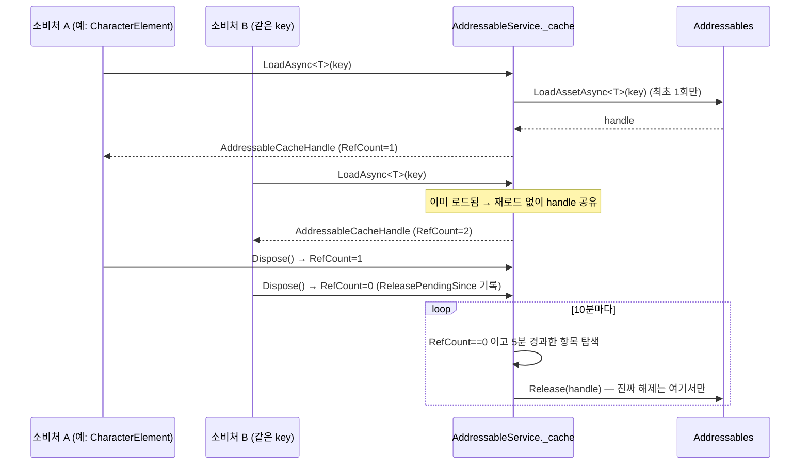

# Addressable — 중앙 에셋 캐시 + Addressable Assets 관리

Unity Addressable Assets 시스템을 래핑한다. 초기화·카탈로그 업데이트·다운로드·인터넷 연결 확인 같은 부팅 단계 기능에 더해, **RefCount + 유예시간(grace period) 기반의 중앙 에셋 캐시**(`LoadAsync<T>`)를 제공한다. `AppLifetimeScope`에서 Singleton EntryPoint로 등록되며, 앱 시작 시 가장 먼저 초기화된다.

이전에는 `AudioManager`, `CharacterElement`, `GameSetting` 등 각 소비처가 `Addressables.LoadAssetAsync`/`Release`를 직접 호출해 개별적으로 관리했다(`Assets/Script/Utility/Runtime/AddressableHandle.cs`라는 별도의 얇은 래퍼도 있었으나 `WaitForCompletion()`으로 동기 로드하는 방식이었다). 같은 키를 여러 곳에서 로드해도 캐시가 공유되지 않아 중복 로드가 일어났고, 씬 전환 시 즉시 Release해버려서 재사용 기회를 놓치는 문제가 있었다. 지금은 이 파일의 `LoadAsync<T>` 하나로 통일했다.

## 파일 구조

| 파일 | 역할 |
|---|---|
| [`AddressableService.cs`](AddressableService.cs) | 구현체 (`Addressable.cs`에서 이름 변경 — 네임스페이스(`Script.Addressable`)와 클래스명이 같았던 걸 정리) |
| [`Interface/IAddressableService.cs`](Interface/IAddressableService.cs) | 인터페이스 |
| [`Interface/AddressableCacheHandle.cs`](Interface/AddressableCacheHandle.cs) | `LoadAsync<T>`가 반환하는 `IDisposable` 핸들. Impl → Interface 단방향 참조 구조를 지키기 위해 Interface 어셈블리에 위치 |

## `LoadAsync<T>` — RefCount + 유예시간 캐시

```csharp
using var handle = await _addressableService.LoadAsync<Sprite>(key, ct);
image.sprite = handle.Value;
// handle을 그 자리에서 바로 Dispose하면 안 되는 경우(로드한 오브젝트 참조를 계속 쓰는 경우)는
// using을 쓰지 말고 필드에 들고 있다가 필요 없어질 때 명시적으로 Dispose할 것.
```

- 같은 `key`로 여러 곳에서 동시에 요청하면 로딩 Task를 `UniTask.Preserve()`로 공유해 중복 로드를 막는다.
- `Dispose()`는 즉시 `Addressables.Release()`를 부르지 않는다. RefCount만 감소시키고, RefCount가 0이 된 시각을 기록해둔다.
- 10분(`CacheCheckIntervalSeconds`)마다 도는 점검 루프가, RefCount==0인 채로 5분(`CacheReleaseGraceSeconds`) 이상 지난 항목만 실제로 `Addressables.Release()`한다.
- 그 사이에 같은 key가 다시 요청되면 RefCount가 다시 올라가 캐시가 그대로 재사용된다 — Release되지 않은 항목은 이미 로드가 끝난 상태이므로 즉시 반환된다.



RefCount가 1이라도 남아있는 동안은 절대 실제 Release가 일어나지 않으므로, "로드해서 쓰고 있는 도중에 다른 곳이 캐시를 비운다"는 걱정은 안 해도 된다. 다만 **핸들을 Dispose한 뒤에도 그 참조(`handle.Value`)를 계속 들고 있으면 위험하다** — Dispose 직후엔 유예시간 동안 안전하지만, 유예시간이 지나 실제 Release가 일어나면 그 참조는 죽은 오브젝트를 가리키게 된다. 로드한 오브젝트를 화면에 계속 표시하는 등 참조를 계속 쓰는 경우에는 `using`으로 즉시 Dispose하지 말고, 그 참조를 쓰는 동안 핸들을 필드로 들고 있다가 필요 없어질 때 명시적으로 Dispose해야 한다.

## 캐시 점검 주기 / 유예시간 설정

`CacheCheckIntervalSeconds`(기본 600초) / `CacheReleaseGraceSeconds`(기본 300초)는 하드코딩 상수가 아니라 [`GameSettingData`](../GameSetting/Data/GameSettingData.cs)의 `addressableCacheCheckIntervalSeconds`/`addressableCacheReleaseGraceSeconds` 필드로 관리되고, `ConfigureCache(float, float)`로 주입받는다.

`AddressableService`가 `GameSetting`을 직접 참조하지 않는 이유: 부팅 순서상 `AddressableService`의 캐시 점검 루프는 `GameSetting`이 로드되기 **전에** 이미 시작된다(`StartUpLogic`이 `InitializeAddressable()` → `InitializeGameSetting()` 순서로 대기하기 때문). `AddressableService`가 `GameSetting`을 참조하게 만들면, `GameSetting`은 자기 데이터를 로드하려고 `AddressableService`를 쓰는데 `AddressableService`는 설정값을 읽으려고 `GameSetting`을 참조하는 순환 의존이 생긴다. 그래서 `IAddressableService`는 primitive 파라미터만 받는 `ConfigureCache` setter만 노출하고, `GameSetting.LoadGameSettingData()`가 자기 데이터를 다 읽은 직후 그 값을 밀어 넣는 방식으로 결합을 끊었다. 부팅 직후 첫 점검 주기 한 번은 기본값(600/300초)으로 돌고, 그 이후부터 설정값이 반영된다.

## 마이그레이션된 소비처

| 소비처 | 패턴 |
|---|---|
| [`AudioManager`](../GamePlay/Audio/AudioManager.cs) | `AudioMixer` — 앱 생존 기간 동안 Dispose하지 않고 RefCount=1 유지 |
| [`AudioManager.Play.cs`](../GamePlay/Audio/AudioManager.Play.cs) | `AudioClip` — `loop=true`거나 `autoRelease=false`인 것만 `_loadedClips`에 pin, 나머지는 재생 시작 직후 손을 떼고 중앙 캐시 유예시간에 재사용을 맡김 |
| [`GameSetting`](../GameSetting/GameSetting.cs) | `GameSettingAsset` — 부팅 시 1회 로드해 값(struct)만 복사해두고 `using`으로 즉시 Dispose |
| [`CharacterElement`](../GUI/ViewModel/CharacterElement.cs) | Spine `SkeletonDataAsset` — ListView 스크롤 재사용 케이스, 캐싱 효과가 가장 크다 |

의도적으로 건드리지 않은 곳: `GameObjectPool`, `ScreenManager`(둘 다 자체적인 캐싱/생명주기 관리 정책이 이미 있어 별도 유지).

## 부팅 시퀀스에서의 위치

```
1. Addressables.InitializeAsync() 완료 대기 (IsInitialized)
2. 캐시 점검 루프(MonitorCacheAsync) 시작 — 기본 설정값으로 시작
3. LoadAppLabelsAsync() — 앱 필수 에셋 로드 (Local 그룹, 인터넷 불필요)
4. (StartUpLogic 다음 단계) GameSetting 로드 완료 시 ConfigureCache()로 설정값 갱신
```

`HasInternetConnectionAsync()` / `UpdateCatalogsAsync()`는 시작 시퀀스에서 더 이상 호출되지 않는다. (에러 팝업 프리팹 등 앱 필수 UI가 Remote 라벨에 걸려 있어 "인터넷 없음" 팝업 자체를 못 띄우는 순환 문제가 있었음 — 필수 에셋을 Local 그룹으로 옮기는 방식으로 해결) 필요 시 원격 콘텐츠 업데이트 체크 용도로 별도 호출 가능.

## 연관 경로

- 등록 위치: `Assets/Script/LifetimeScope/AppLifetimeScope.cs`
- 초기화 호출: `Assets/Script/Scene/StartUpLogic.cs`
- 캐시 설정값: `Assets/Script/GameSetting/README.md`
