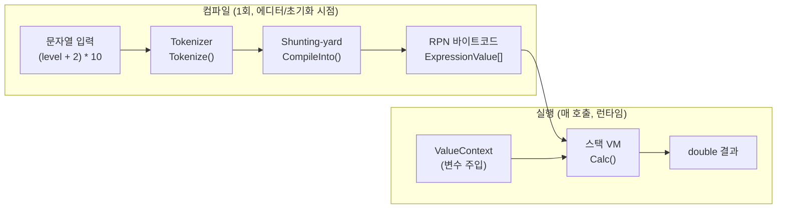

# Expression — 수식 연산 라이브러리

기획 수식(`(level + 1) * 10`, `Pow(tier, 2)` 등)을 런타임에 계산하는 **Unity 비의존 순수 C# 라이브러리**입니다.
`Script/GameInfo`와 마찬가지로 서버에서도 그대로 재사용 가능하도록 설계했고, 추후 별도 dll 프로젝트로 분리할 계획입니다.

> 상세 설계 문서: [ARCHITECTURE.md](ARCHITECTURE.md)
> 상위 문서: [최상위 CLAUDE.md](../../../CLAUDE.md)

## 왜 만들었는가

기획 데이터에는 `damage = (level + 1) * atk` 같은 수식이 많은데, 이걸 매 계산마다 문자열을 파싱하면 느립니다. 그래서 **"컴파일은 한 번, 실행은 여러 번"** 이라는 원칙으로 나눴습니다 — 수식 문자열은 에디터/초기화 시점에 RPN(역폴란드 표기법) 바이트코드로 미리 변환해두고, 런타임에는 그 바이트코드를 스택 기반 VM으로 실행만 합니다. 원본 문자열은 저장하지 않고 바이트코드만 MessagePack으로 직렬화합니다.



## 폴더 구조

| 파일 | 역할 | 링크 |
|---|---|---|
| `Expression.cs` | 컴파일(`CompileInto`, Shunting-yard) + 런타임 실행(`Calc`, 스택 VM) — 라이브러리의 핵심 | [Expression.cs](Expression.cs) |
| `Tokenizer.cs` | 수식 문자열 → Token 배열 (숫자/변수/함수/연산자/괄호) | [Tokenizer.cs](Tokenizer.cs) |
| `ExpressionValue.cs` | RPN 명령어 1개를 표현하는 구조체 (MessagePack `[Key(n)]`) | [ExpressionValue.cs](ExpressionValue.cs) |
| `ExprFunction.cs` | 내장 함수 enum(`Pow`/`Log`/`Min`/`Max`) 및 이름 파싱 | [ExprFunction.cs](ExprFunction.cs) |
| `Context/ValueContext.cs` | `AsyncLocal` 기반 변수 스코프 관리 (`using` 블록) | [Context/ValueContext.cs](Context/ValueContext.cs) |
| `Context/ValueProvider.cs` | 변수명-값 저장소 (`Add()`로 체이닝 구성) | [Context/ValueProvider.cs](Context/ValueProvider.cs) |
| `Context/ValueStringKey.cs` | 변수명 문자열 → int 키 매핑 테이블 (동적 등록 지원) | [Context/ValueStringKey.cs](Context/ValueStringKey.cs) |
| `Interface/IValue.cs` | 값 하나를 노출하는 인터페이스 | [Interface/IValue.cs](Interface/IValue.cs) |
| `Interface/IValueProvider.cs` | `ValueContext`에 꽂히는 변수 제공자 인터페이스 | [Interface/IValueProvider.cs](Interface/IValueProvider.cs) |
| `Editor/ExpressionPropertyDrawer.cs` | Odin Inspector에서 바이트코드를 수식 문자열로 역표시/편집/재컴파일 (Editor 전용, `#if UNITY_EDITOR`) | [Editor/ExpressionPropertyDrawer.cs](Editor/ExpressionPropertyDrawer.cs) |

## 1단계 — Tokenization ([`Tokenizer.cs`](Tokenizer.cs))

문자열을 `Span<char>` 기반으로 스캔하며 `Token` 배열로 분리합니다. 힙 할당을 줄이기 위해 문자열 슬라이싱 대신 `ReadOnlySpan<char>`를 그대로 넘겨 비교/파싱합니다.

| TokenKind | 설명 |
|---|---|
| `Number` | 숫자 리터럴 (`1.5e-2` 같은 과학 표기법 포함) |
| `Var` | 변수명 → [`ValueStringKey`](Context/ValueStringKey.cs)로 int 키 변환 |
| `Func` | 함수명(`pow`/`log`/`min`/`max`, 대소문자 무시) — 뒤에 `(`가 오는지 **lookahead**로 판별해 변수와 구분 |
| `Plus`/`Minus`/`Star`/`Slash` | 이항 연산자 |
| `LParen`/`RParen`/`Comma` | 괄호, 함수 인자 구분자 |

## 2단계 — Compilation ([`Expression.cs`](Expression.cs) `CompileInto()`)

**Shunting-yard 알고리즘**으로 Token 스트림을 RPN 바이트코드로 변환합니다.

| 연산자 | 우선순위 |
|---|---|
| 단항 `-` (Neg) | 3 (최고) |
| `*`, `/` | 2 |
| `+`, `-` (이항) | 1 |

컴파일 도중 스택 깊이(`sp`)를 함께 추적해 최대 깊이(`maxSp`)를 계산해두는데, 이 값이 런타임 `stackalloc` 크기를 결정합니다.

```
입력:  (level + 2) * 10
RPN:   PUSH_VAR(level)  PUSH_CONST(2)  ADD  PUSH_CONST(10)  MUL
maxStack: 2
```

**단항/이항 `-` 구분:** 직전 토큰이 "값이 올 수 있는 자리"였는지(`prevCanBeUnary`)로 판별합니다 — 여는 괄호·연산자·함수 직후의 `-`는 단항(`Neg`, 우선순위 3), 그 외는 이항 `Sub`(우선순위 1)로 처리합니다.

## 3단계 — Runtime Execution ([`Expression.cs`](Expression.cs) `Calc()`)

컴파일된 RPN 바이트코드를 스택 기반 VM으로 순서대로 실행합니다.

```
스택: []
→ PUSH_VAR(level)  →  [5]     // ValueContext에서 level=5 주입
→ PUSH_CONST(2)    →  [5, 2]
→ ADD              →  [7]
→ PUSH_CONST(10)   →  [7, 10]
→ MUL              →  [70]
결과: 70.0
```

**스택 메모리 정책:** 최대 깊이 ≤ 256이면 `stackalloc double[n]`(힙 할당 없음), 초과 시에만 `new double[n]`으로 폴백합니다. `Calc()`/`EvalFunction()`은 `[MethodImpl(AggressiveInlining)]`으로 인라인화되어 있습니다.

## Context Pattern — 변수 주입

수식 안의 `level`, `grade`, `tier` 같은 변수를 호출 시점에 주입하는 구조입니다. `AsyncLocal<Stack<IValueProvider>>` 기반이라 **중첩 가능**하고 **비동기 흐름에서도 안전**합니다.

```csharp
using (new ValueContext(new ValueProvider().Add("level", 10).Add("grade", 5))) {
    double result = expression.Calc();   // level=10, grade=5로 계산
}
// 블록 종료(Dispose) 시 스택에서 자동 pop
```

- [`ValueStringKey.cs`](Context/ValueStringKey.cs): `"level"→0`, `"grade"→1`, `"tier"→2`는 사전 등록되어 있고, 새 변수명은 런타임에 동적으로 키를 발급합니다 (.NET 8+에서는 `GetAlternateLookup<ReadOnlySpan<char>>`로 조회 시 문자열 할당 없이 처리).
- 여러 `ValueContext`가 중첩되면 [`ValueContext.TryGetValue`](Context/ValueContext.cs)가 스택을 순회하며 **가장 안쪽(마지막에 push된) provider부터** 값을 찾습니다.
- 미등록 변수는 예외 대신 기본값 `0`을 반환합니다 (`Expression.Calc()`의 `PushVar` 분기).

## 지원 연산자 / 함수

**연산자:** `+`, `-` (이항/단항), `*`, `/`

| 함수 | 인자 | 예시 |
|---|---|---|
| `Pow(a, b)` | 2개 | `Pow(tier, 2)` → tier² |
| `Log(x)` / `Log(x, base)` | 1~2개 | `Log(8, 2)` → 3 |
| `Min(a, b, ...)` | 2개 이상 | `Min(level, 10)` |
| `Max(a, b, ...)` | 2개 이상 | `Max(grade, 1)` |

함수 인자 개수(arity)는 컴파일 시 [`Expression.ValidateArity()`](Expression.cs)에서 검증하며, 잘못된 인자 수는 컴파일 단계에서 `FormatException`으로 즉시 걸러집니다.

## Editor 지원 — [`ExpressionPropertyDrawer.cs`](Editor/ExpressionPropertyDrawer.cs)

`Expression`은 **바이트코드만** 직렬화하고 원본 문자열은 저장하지 않기 때문에, Inspector에는 사람이 읽을 수 있는 수식이 없습니다. 이를 보완하기 위한 Odin `OdinValueDrawer<Expression>` 구현입니다.

- **역컴파일(Decompile)**: RPN 바이트코드를 다시 중위 표기 수식 문자열로 변환해 보여줍니다. 연산자 우선순위를 비교해 필요한 곳에만 괄호를 자동으로 붙입니다 (`a - (b + c)`처럼 뺄셈/나눗셈의 우변은 동일 우선순위여도 괄호 필요).
- **편집**: 텍스트 필드에서 수식을 직접 수정 (자동 컴파일은 하지 않음 — 의도적으로 명시적 "Compile" 버튼만 반영).
- **재컴파일**: "Compile" 버튼으로 `new Expression(editText)`를 생성해 `_code`/`_maxStack`을 갱신, 실패 시 에러 메시지 표시 + "Revert"로 직전 상태 복원.
- **Bytecode 보기**: 접이식 패널로 RPN 명령어를 `PUSH_VAR level`, `CALL Pow arity=2` 형태로 디스어셈블해서 보여줍니다.

## 주요 최적화 포인트

- 수식 문자열을 바이트코드로 **사전 컴파일** → 런타임 파싱 비용 0
- 변수명을 **int 키로 사전 변환** → 런타임엔 문자열 비교 없이 딕셔너리/배열 조회만
- `stackalloc` 사용 → 계산 1회당 힙 할당 없음 (256 슬롯 이하)
- `[MethodImpl(AggressiveInlining)]` → `Calc`/`EvalFunction` 인라인화
- MessagePack으로 바이트코드만 직렬화 → 원본 문자열 저장/파싱 불필요

## 연관 문서

- [ARCHITECTURE.md](ARCHITECTURE.md) — 이 문서의 원본 설계 문서
- [GameInfo/ARCHITECTURE.md](../GameInfo/ARCHITECTURE.md) — 같은 원칙(Unity 비의존, 서버 공용)으로 설계된 기획 데이터 레이어
