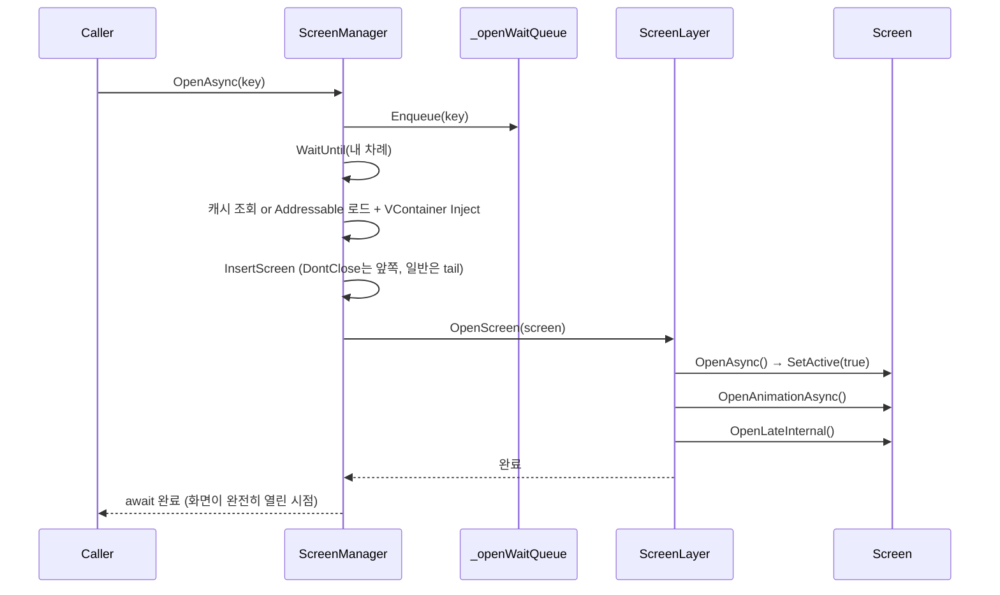

# GUI — Screen 관리 프레임워크

게임의 모든 화면(HUD, 팝업, 로딩, 스테이지 전환 등)을 관리하는 자체 UI 프레임워크입니다.
[`AppLifetimeScope`](../LifetimeScope/AppLifetimeScope.cs)에서 Addressable로 프리팹을 Instantiate해 생성하며, `DontDestroyOnLoad`로 앱 실행 직후부터 종료까지 생존합니다.

> 더 깊은 설계 배경: [ARCHITECTURE.md](ARCHITECTURE.md) (Screen 시스템) · [SW_GUI/ARCHITECTURE.md](SW_GUI/ARCHITECTURE.md) (커스텀 위젯)
> 상위 문서: [최상위 CLAUDE.md](../../../CLAUDE.md)

## 이 폴더가 다루는 세 가지 시스템

| 시스템 | 역할 | 핵심 클래스 |
|---|---|---|
| **Screen 관리** | 화면 열기/닫기, 스택 순서, 리소스 캐싱 | [`ScreenManager`](ScreenManager/ScreenManager.cs), [`Screen`](Screen/Base/Screen.cs) |
| **ViewModel** | 데이터 → UI 반응형 바인딩, 리스트 아이템 선택 상태 관리 | [`ViewModel`](ViewModel/Base/ViewModel.cs), [`SelectElement`](Base/SelectElement.cs) / [`Selector`](Base/Selector.cs) |
| **SW_GUI** | Unity 기본 Button을 대체하는 경량 커스텀 위젯 | [`SW_GUI_BUTTON_BASE`](SW_GUI/Base/SW_GUI_BUTTON_BASE.cs) (상세: [SW_GUI/ARCHITECTURE.md](SW_GUI/ARCHITECTURE.md)) |

---

## 1. Screen 관리 시스템

### 왜 Stack이 아니라 LinkedList인가

UI가 쌓이는 형태는 논리적으로 Stack이지만, 실제 요구사항은 "특정 화면 뒤에 열고 싶다", "특정 화면만 골라서 닫고 싶다"처럼 순수 Stack으로는 처리하기 어려운 케이스가 반복적으로 발생했습니다. 그래서 **이중 연결 리스트로 구현하되 동작은 Stack을 지향**하는 절충안을 택했습니다 ([`Screen.Node.cs`](Screen/Base/Screen.Node.cs)가 `Previous`/`Next`를 보관).

```
[DontClose] → [DontClose] → [Normal] → [Normal] → (tail = 최상위 화면)
     ↑ 항상 앞쪽에 고정                     ↑ 새 화면은 항상 tail에 append
```

- **DontClose 화면**(HUD, Navigation 등): 항상 리스트 앞부분에 순차 배치, 일반 `Close`의 영향을 받지 않고 `force: true`로만 닫힘
- **일반 화면**: `Back()`(권장) 또는 `CloseAsync()` 호출 시 자신부터 tail까지 한 번에 닫힘 — 상세 로직: [`ScreenManager.cs`](ScreenManager/ScreenManager.cs)의 `CollectCloseTargets`

### Layer 시스템 — 렌더링 순서 제어

`ScreenManager.CreateLayer()`가 Canvas 아래에 `ScreenLayerType`([Enum](ScreenManager/Enum/ScreenLayerType.cs)) 개수만큼 RectTransform을 만들고, 각 [`ScreenLayer`](ScreenManager/ScreenLayer.cs)가 해당 레이어에 속한 Screen들의 Open/Close를 담당합니다.

| Layer | 순서 | 용도 |
|---|---|---|
| `HUD` | 0 | 게임 HUD (체력바, 미니맵 등) |
| `None` | 1 | 기본 레이어 (별도 설정 없으면 여기) |
| `Popup` | 2 | 팝업 창 |
| `Overlay` | 3 | 오버레이 |
| `StageTransition` | 4 | 스테이지 시작/재시작 전환 오버레이 |
| `Loading` | 5 | 로딩 화면 |
| `SafeArea` | 6 | 입력 차단 (최상위) |

### Open — Queue로 순서를 보장하는 비동기 흐름



동시에 여러 `OpenAsync`가 호출돼도 큐 순서대로 처리되며, `OpenAsync()`를 `await`하면 애니메이션까지 포함해 화면이 **완전히 열릴 때까지** 대기가 보장됩니다. `Close`도 동일하게 `_closeWaitQueue`로 직렬화됩니다 ([`ScreenManager.cs`](ScreenManager/ScreenManager.cs)).

### Screen 캐싱 전략

```
처음 Open → Addressable 로드 → VContainer Inject → _loadedScreens[key]에 저장
재오픈    → _loadedScreens[key] 조회 → 로딩 없이 즉시 사용
Close     → SetActive(false)만 수행, _loadedScreens에서 제거하지 않음 (메모리에 유지)
씬 이동   → ResourceClear() → _loadedScreens 전체 Destroy + Addressable Release
```

별도의 Preload 기능은 의도적으로 만들지 않았습니다 — "Preload가 필요할 만큼 무거운 UI는 이미 설계 문제"라는 원칙 하에, 한 번 연 화면을 메모리에 유지해 재오픈 속도를 보장하는 쪽을 택했습니다.

### StageTransition — 스폰/T포즈를 가리는 전환 오버레이

스테이지 시작·재시작 시 맵 스폰, 캐릭터 초기화 같은 준비 과정이 화면에 그대로 노출되지 않도록, 직전 화면을 캡처해 덮어씌우는 전용 레이어입니다. Screen 프리팹이 아니라 `StageTransition` Layer 오브젝트에 `RawImage` + `CanvasGroup`을 직접 `AddComponent`해서 구성합니다 ([`ScreenManager.StageTransition.cs`](ScreenManager/ScreenManager.StageTransition.cs)).

```
ShowStageTransitionAsync()
  → WaitForEndOfFrame (해당 프레임 GPU 렌더링 완료 대기)
  → ScreenCapture.CaptureScreenshotAsTexture() → RawImage.texture
  → CanvasGroup.alpha = 1, blocksRaycasts = true
  → ShowLoadingAsync() (Loading을 그 위에 자동 노출)

... 맵/캐릭터 스폰 진행 (화면은 캡처된 스냅샷으로 가려짐) ...

HideStageTransitionAsync()
  → HideLoadingAsync()
  → CanvasGroup.alpha를 fadeDuration 동안 1 → 0 (Fade Out)
  → 캡처해둔 Texture2D Destroy
```

**주의 — `CaptureScreenshotAsTexture()` 호출 타이밍:** 해당 프레임의 GPU 렌더링이 실제로 끝난 뒤(`WaitForEndOfFrame` 이후)에 호출해야 유효한 픽셀을 반환합니다. 그 전에 호출하면 빈 텍스처가 캡처됩니다. 호출 지점: [`StageManager.cs`](../GamePlay/Stage/StageManager.cs)의 `InitializeAsync()` / `ReStart()`.

### Loading — `_loadedScreens`를 우회하는 상시 보관 화면

`"Loading"` id로 등록된 일반 Screen([`Loading.cs`](Screen/Loading/Loading.cs))이지만, 자주 열고 닫히는 화면이라 매번 로드/Destroy하는 낭비를 피하기 위해 `OpenAsync(key)` 공개 API를 타지 않고 [`ScreenManager.Loading.cs`](ScreenManager/ScreenManager.Loading.cs)가 최초 1회만 로드해 필드로 직접 보관합니다. `_loadedScreens` Dictionary를 거치지 않으므로 씬 이동 시 `ResourceClear()`의 파괴 대상에서도 제외됩니다.

---

## 폴더/파일 구조

| 폴더 | 역할 | 주요 파일 |
|---|---|---|
| `ScreenManager/` | 핵심 관리자 (partial class로 관심사 분리) | [`ScreenManager.cs`](ScreenManager/ScreenManager.cs) (Open/Close/LinkedList), [`.State.cs`](ScreenManager/ScreenManager.State.cs), [`.Injection.cs`](ScreenManager/ScreenManager.Injection.cs) (VContainer DI), [`.Pool.cs`](ScreenManager/ScreenManager.Pool.cs) (UI 풀링 위임), [`.ErrorMesssage.cs`](ScreenManager/ScreenManager.ErrorMesssage.cs), [`.StageTransition.cs`](ScreenManager/ScreenManager.StageTransition.cs), [`.Loading.cs`](ScreenManager/ScreenManager.Loading.cs) |
| `ScreenManager/Enum/` | 상태/레이어/옵션 Flags enum | [`ScreenManagerState.cs`](ScreenManager/Enum/ScreenManagerState.cs), [`ScreenLayerType.cs`](ScreenManager/Enum/ScreenLayerType.cs), [`ScreenOption.cs`](ScreenManager/Enum/ScreenOption.cs) |
| `ScreenManager/ScreenData/` | Screen id ↔ Addressable 참조 등록 목록 | [`ScreenData.cs`](ScreenManager/ScreenData/ScreenData.cs), [`ScreenAsset.cs`](ScreenManager/ScreenData/ScreenAsset.cs) |
| `ScreenManager/ScreenLayer.cs` | Layer 하나의 Open/Close 실행 | [`ScreenLayer.cs`](ScreenManager/ScreenLayer.cs) |
| `ScreenManager/Interface/` | 관리자 인터페이스 | [`IScreenManager.cs`](ScreenManager/Interface/IScreenManager.cs) |
| `Screen/Base/` | Screen 베이스 클래스 (partial class) | [`Screen.cs`](Screen/Base/Screen.cs), [`Screen.Node.cs`](Screen/Base/Screen.Node.cs) (LinkedList), [`Screen.Option.cs`](Screen/Base/Screen.Option.cs) (DontClose), [`Screen.UnityEvent.cs`](Screen/Base/Screen.UnityEvent.cs) (뒤로가기 버튼 자동 등록) |
| `Screen/Interface/` | Screen 인터페이스 + 상태 Flags | [`IScreen.cs`](Screen/Interface/IScreen.cs) |
| `Screen/Loading/`, `Screen/PopUp/`, `Screen/Title/`, `Screen/Lobby/`, `Screen/Running/` | 실제 화면 구현 예시 | [`CountDown.cs`](Screen/PopUp/CountDown.cs), [`MessageBox.cs`](Screen/PopUp/MessageBox.cs), [`Loading.cs`](Screen/Loading/Loading.cs), [`TitleHUD.cs`](Screen/Title/TitleHUD.cs), [`LobbyHUD.cs`](Screen/Lobby/LobbyHUD.cs), [`RunningHUD.cs`](Screen/Running/RunningHUD.cs) 등 |
| `ScreenOption/` | `OpenAsync`에 전달하는 화면별 파라미터 (`IScreenOption`) | [`Interface/IScreenOption.cs`](ScreenOption/Interface/IScreenOption.cs), [`MessageBoxOption.cs`](ScreenOption/MessageBoxOption.cs) (`IClassPool`로 재사용), [`CountDownOption.cs`](ScreenOption/CountDownOption.cs), [`MessageBoxError.cs`](ScreenOption/MessageBoxError.cs) |
| `ViewModel/` | 반응형 데이터 바인딩 | 아래 [ViewModel 섹션](#2-viewmodel--반응형-데이터-바인딩) 참고 |
| `Base/` | 리스트 아이템 선택 상태 관리 | [`SelectElement.cs`](Base/SelectElement.cs), [`Selector.cs`](Base/Selector.cs) |
| `SW_GUI/` | 커스텀 UI 위젯 (독립 서브시스템) | 아래 [SW_GUI 섹션](#3-sw_gui--커스텀-ui-위젯) 참고 |

---

## 2. ViewModel — 반응형 데이터 바인딩

`R3`(Reactive Extensions) `ReactiveProperty`로 데이터를 감싸 값이 바뀌면 UI가 자동 갱신되도록 하는 계층입니다. 현재 두 가지 베이스 클래스가 공존합니다.

| 베이스 | 생명주기 | 사용처 |
|---|---|---|
| [`ViewModel`](ViewModel/Base/ViewModel.cs) | `Awake`/`OnEnable` → `Initialize()`, `OnDisable` → `Disable()`. `State`(Flags) 기반, `objectActiveInitialize`/`autoInitializeState` 옵션으로 초기화 시점 커스터마이즈 가능 | [`TextViewModel`](ViewModel/TextViewModel.cs), [`AudioOptionViewModel`](ViewModel/OptionModel/AudioOptionViewModel.cs) |
| [`ViewModelBase`](ViewModel/ViewModelBase.cs) | `Awake()`에서 1회만 `Initialize()` | [`DiffResultViewModel`](ViewModel/DiffResultViewModel.cs) |

- [`IViewModel`](ViewModel/Interface/IViewModel.cs) / [`ViewModelState`](ViewModel/Interface/ViewModelState.cs) — `ViewModel` 계열이 구현하는 공통 상태 인터페이스
- [`IIconModel`](ViewModel/Interface/IIconModel.cs) / [`IInfoModel`](ViewModel/Interface/IInfoModel.cs) — 아이콘/정보 표시가 필요한 ViewModel이 구현하는 태그성 인터페이스

**R3 바인딩 패턴 예시** ([`DiffResultViewModel.cs`](ViewModel/DiffResultViewModel.cs)):
```csharp
DiffResult.CombineLatest(CharacterInfo, ItemData, (diff, info, item) => (diff, info, item))
          .Subscribe(data => { /* 값이 바뀔 때마다 텍스트 갱신 */ })
          .AddTo(ref _disposableBag);   // 소멸 시 자동 구독 해제
```

### SelectElement / Selector — 리스트 선택 상태 중앙 관리

리스트(캐릭터 선택, 스테이지 선택 등)에서 "지금 뭐가 선택됐는가"를 개별 아이템이 아니라 상위 [`Selector`](Base/Selector.cs)가 관리합니다.

```
Selector (Screen 상속)
  ├─ Register(element) / Unregister(element)
  ├─ Select(element)   → SelectorType.Single이면 같은 Key의 나머지 전부 해제 후 선택
  ├─ AllDeselect()
  └─ ReleaseSelector()
       ↑
SelectElement (MonoBehaviour)
  ├─ Key: int          → Selector 내에서 그룹을 구분하는 식별자
  ├─ Selected: bool     → 세터에서만 On/DeSelect 콜백 발생 (Selector 밖에서 직접 대입 금지)
  └─ Select() / Deselect() → 항상 Selector에 위임
```

| 구현체 | 용도 |
|---|---|
| [`CharacterElement.cs`](ViewModel/CharacterElement.cs) | 캐릭터 선택 리스트 아이템 — 아이템 보유 여부에 따라 버튼 활성화, Spine 스켈레톤 프리뷰 로드 |
| [`StageElement.cs`](ViewModel/StageElement.cs) | 스테이지 선택 리스트 아이템 |

---

## 3. SW_GUI — 커스텀 UI 위젯

`Assets/Script/GUI/`(Screen 관리 시스템)와는 독립된 서브시스템으로, Unity 기본 `Button`/`Toggle`을 대체합니다. 상세 설계는 [SW_GUI/ARCHITECTURE.md](SW_GUI/ARCHITECTURE.md)에 정리되어 있고, 핵심만 요약하면 다음과 같습니다.

**왜 기본 Button을 안 쓰는가** — Unity 기본 `Button`은 쓰지 않는 기능(Transition, Navigation 등)까지 프리팹에 직렬화되어 에셋이 커지고 확장이 어렵습니다. `IPointerClickHandler`를 직접 구현해 필요한 기능만 가진 경량 버튼을 만들었습니다 ([`SW_GUI_BUTTON_BASE.cs`](SW_GUI/Base/SW_GUI_BUTTON_BASE.cs)).

| 파일 | 역할 |
|---|---|
| [`Base/SW_GUI_BASE.cs`](SW_GUI/Base/SW_GUI_BASE.cs) | 모든 위젯의 최상위 베이스. `Initialize()`는 Unity 생명주기가 아니라 **호출부가 명시적으로 호출** |
| [`Base/SW_GUI_BUTTON_BASE.cs`](SW_GUI/Base/SW_GUI_BUTTON_BASE.cs) | `IPointerClickHandler` 구현. 클릭 딜레이 옵션, 스크립트 리스너 → `OnClick()` → 인스펙터 이벤트 순으로 호출 |
| [`Base/SW_GUI_TOGGLE_BASE.cs`](SW_GUI/Base/SW_GUI_TOGGLE_BASE.cs) | On/Off 상태 보유. 값이 실제로 바뀔 때만 이벤트 발생, `notify=false`로 이벤트 없이 초기값만 세팅 가능 |
| [`Base/Group/SW_GUI_BUTTON_GROUP_BASE.cs`](SW_GUI/Base/Group/SW_GUI_BUTTON_GROUP_BASE.cs) | 탭 메뉴 등 버튼 그룹 관리. `SelectType.Single`/`Multiple` 지원 |
| [`Base/Group/SW_GUI_BUTTON_GROUP_ELEMENT_BASE.cs`](SW_GUI/Base/Group/SW_GUI_BUTTON_GROUP_ELEMENT_BASE.cs) | 그룹에 속하는 버튼 하나 |
| [`Group/SW_GUI_BUTTON_GROUP.cs`](SW_GUI/Group/SW_GUI_BUTTON_GROUP.cs), [`Group/SW_GUI_BUTTON_GROUP_ELEMENT.cs`](SW_GUI/Group/SW_GUI_BUTTON_GROUP_ELEMENT.cs) | 실사용 구현체 (UnityEvent 노출) |
| [`SW_GUI_BUTTON.cs`](SW_GUI/SW_GUI_BUTTON.cs), [`SW_GUI_BUTTON_SIMPLE.cs`](SW_GUI/SW_GUI_BUTTON_SIMPLE.cs), [`SW_GUI_TOGGLE.cs`](SW_GUI/SW_GUI_TOGGLE.cs) | 실사용 버튼/토글 |

**asmdef로 참조 방향 강제:** `SW.GUI.Base` / `SW.GUI` / `SW.GUI.Interface`로 분리해 Base가 구현체를 참조하지 못하도록 강제합니다. 독립 라이브러리로 취급하며 기본 Unity/SDK/`Utility` 외의 어셈블리 참조를 금지합니다.

**버튼 그룹 등록 시 주의점:** `Register()`/`Initialize()`는 반드시 `element.Group = this`를 설정해야 합니다 — 이게 빠지면 요소의 `OnClick()`이 `Group == null`로 조용히 무시되어 클릭이 아예 반응하지 않는 버그가 생깁니다 (실제로 한 번 발생했던 이슈).

---

## 연관 문서 / 코드

- [ARCHITECTURE.md](ARCHITECTURE.md) — Screen 시스템 설계 원칙 전문 (Queue 처리, IScreenManager 인터페이스 전체, ScreenKey 어트리뷰트)
- [SW_GUI/ARCHITECTURE.md](SW_GUI/ARCHITECTURE.md) — SW_GUI 위젯 시스템 설계 원문
- [`ScreenKeyAttribute.cs`](../GameInfo/Attribute/ScreenKeyAttribute.cs) / [`ScreenKeyDrawer.cs`](../Editor/Attribute/ScreenKeyDrawer.cs) — Screen을 문자열 대신 Inspector 드롭다운으로 선택하는 어트리뷰트
- [`AppLifetimeScope.cs`](../LifetimeScope/AppLifetimeScope.cs) — `ScreenManager` 생성 위치
- [`UIPooling.cs`](../GamePlay/Pool/UIPooling.cs) — Screen 내부에서 사용하는 동적 UI GameObject 풀링
