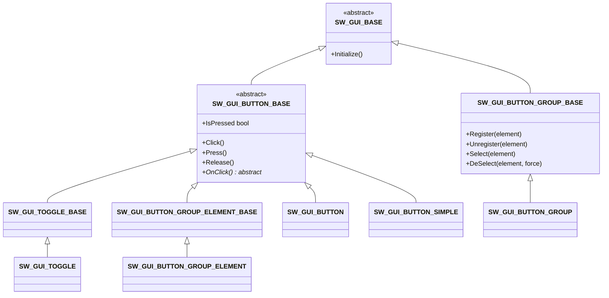
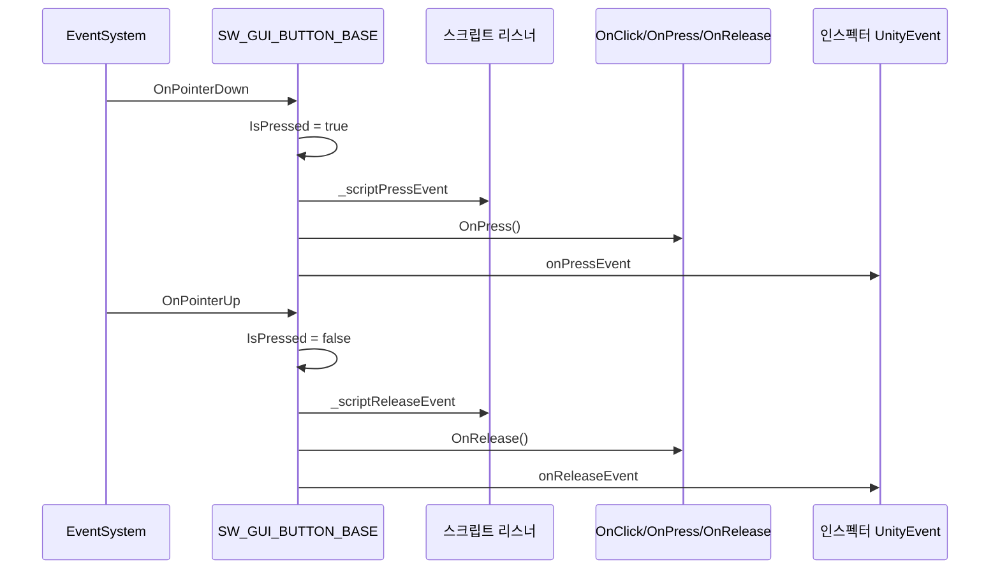

# SW_GUI — 커스텀 UI 위젯 시스템

Unity 기본 UI 컴포넌트(`Button`, `Toggle`)를 대체하는 경량 커스텀 위젯 라이브러리입니다.
[`Assets/Script/GUI/`](../README.md)(Screen 관리 시스템)와는 독립된 서브시스템으로, 개별 UI 요소(버튼, 토글, 버튼 그룹)의 입력 처리만 담당합니다.

> 설계 배경 원문: [ARCHITECTURE.md](ARCHITECTURE.md)
> 상위 문서: [GUI/README.md](../README.md) · [최상위 CLAUDE.md](../../../CLAUDE.md)

## 왜 기본 Button/Toggle을 직접 만들었나

Unity 기본 `Button`/`Toggle`은 프로젝트에서 쓰지 않는 기능(Transition, Navigation 등)까지 프리팹에 그대로 직렬화되어 에셋이 불필요하게 커지고, 필요한 기능(예: 모바일 온스크린 Press/Release, 클릭 딜레이)을 얹으려 하면 기존 컴포넌트와 호환이 어려워집니다. 그래서 `IPointerClickHandler` / `IPointerDownHandler` / `IPointerUpHandler`를 직접 구현해, 필요한 기능만 가진 얇은 베이스 클래스 위에서 확장하는 방식을 택했습니다.

## 폴더/파일 구조

| 경로 | 역할 |
|---|---|
| [`Base/SW_GUI_BASE.cs`](Base/SW_GUI_BASE.cs) | 모든 위젯의 최상위 추상 클래스. `Initialize()` 하나만 선언 |
| [`Base/SW_GUI_BUTTON_BASE.cs`](Base/SW_GUI_BUTTON_BASE.cs) | Click / Press / Release 입력 파이프라인 전체 구현 |
| [`Base/SW_GUI_TOGGLE_BASE.cs`](Base/SW_GUI_TOGGLE_BASE.cs) | `SW_GUI_BUTTON_BASE`를 상속해 On/Off 상태를 추가 |
| [`Base/Group/SW_GUI_BUTTON_GROUP_BASE.cs`](Base/Group/SW_GUI_BUTTON_GROUP_BASE.cs) | 버튼 그룹(탭 메뉴 등) 관리자 |
| [`Base/Group/SW_GUI_BUTTON_GROUP_ELEMENT_BASE.cs`](Base/Group/SW_GUI_BUTTON_GROUP_ELEMENT_BASE.cs) | 그룹에 속하는 버튼 하나 |
| [`SW_GUI_BUTTON.cs`](SW_GUI_BUTTON.cs) | 실사용 버튼 — `Graphic` 색상으로 비활성/눌림 상태를 시각 피드백 |
| [`SW_GUI_BUTTON_SIMPLE.cs`](SW_GUI_BUTTON_SIMPLE.cs) | 아무 시각 피드백도 없는 최소 구현체 (인스펙터 이벤트만으로 충분한 경우) |
| [`SW_GUI_TOGGLE.cs`](SW_GUI_TOGGLE.cs) | 체크마크 `GameObject`를 On/Off에 맞춰 활성화하는 기본 Toggle |
| [`Group/SW_GUI_BUTTON_GROUP.cs`](Group/SW_GUI_BUTTON_GROUP.cs) | 실사용 그룹 — 시작 시 0번째 요소를 자동 선택 |
| [`Group/SW_GUI_BUTTON_GROUP_ELEMENT.cs`](Group/SW_GUI_BUTTON_GROUP_ELEMENT.cs) | 실사용 그룹 요소 — 선택 시 `Graphic` 색상 전환, 에디터에서 부모 그룹 자동 탐색/등록 |

## 클래스 계층



`Initialize()`는 Unity 생명주기 콜백이 아니라 **호출부가 명시적으로 호출**해줘야 합니다. 유일한 예외는 그룹입니다 — [`SW_GUI_BUTTON_GROUP_BASE.Awake()`](Base/Group/SW_GUI_BUTTON_GROUP_BASE.cs)가 자동으로 `Initialize()`를 호출해, 인스펙터에 미리 등록해 둔 요소들을 씬 시작 시점에 연결합니다.

## Click / Press / Release 파이프라인

`Click`(누르고 뗌)과 별개로 `Press`/`Release`(누르고 있는 동안)를 독립적으로 제공합니다. 모바일 온스크린 점프 버튼처럼 "누르는 동안 입력이 지속돼야 하는" 케이스를 위한 것입니다.



Click/Press/Release 모두 **스크립트 리스너 → 가상 메서드 훅 → 인스펙터 이벤트** 순서로 고정 호출됩니다.

**눌린 상태(`IsPressed`)가 고정되는 걸 막는 안전장치 2개** ([`SW_GUI_BUTTON_BASE.cs`](Base/SW_GUI_BUTTON_BASE.cs)):
1. `OnDisable()` 시 `IsPressed`면 강제로 `Release()` — 오브젝트가 비활성화/파괴될 때 "손가락을 뗀 이벤트"를 못 받는 경우 대비
2. `Interactable`을 `false`로 바꿀 때도 `IsPressed`면 강제로 `Release()`

**Input System `OnScreenButton`은 의도적으로 쓰지 않습니다.** `controlPath`마다 런타임에 `InputSystem.AddDevice()`로 새 가상 Device를 생성하는데, 이미 Enable된 액션맵이 있으면 그 Device의 `Added` 이벤트가 Input System 내부 재해석 버그(assert 실패)를 유발합니다. Editor에서는 재현되지 않고 Standalone 빌드에서만 나타나 발견이 늦어지기 쉽습니다. 모바일 입력은 이 Press/Release를 게임 로직에 직접 연결하는 방식을 씁니다 — 아래 [실사용 예시](#실사용-예시--모바일-jump-버튼) 참고.

`Click()`은 `useDelay`가 켜져 있으면 `delay`(초) 동안 재클릭을 무시합니다 ([`SW_GUI_BUTTON_BASE.cs`](Base/SW_GUI_BUTTON_BASE.cs)).

### Click의 비동기 버전 — `AddClickAsyncListener`

동기 `_scriptClickEvent`(`UnityEvent`)와 별개로 `Func<UniTask>` 시그니처의 비동기 리스너도 등록할 수 있습니다. `Click()`은 내부적으로 `ClickAsync()`(`async UniTaskVoid`)를 `Forget()`으로 실행하며, 등록된 비동기 리스너 전부를 `OnClick()`/인스펙터 이벤트보다 먼저(동기 `_scriptClickEvent`와 같은 위치에서) `UniTask.WhenAll`로 `await`합니다. 여러 리스너가 등록돼 있으면 전부 완료될 때까지 기다린 뒤에야 `OnClick()`으로 넘어갑니다.

```csharp
public void AddClickAsyncListener(Func<UniTask> listener, bool removeAll = true);
public void RemoveClickAsyncListener(Func<UniTask> listener);
```

**도입 배경:** 튜토리얼 Focus 시스템([`GamePlay/Tutorial/ARCHITECTURE.md`](../../GamePlay/Tutorial/ARCHITECTURE.md))이 오버레이의 대리 버튼을 클릭했을 때 "실제 대상 버튼에 클릭을 전달하기 전에 SafeArea부터 켠다" 같은 비동기 선행 작업을 걸어야 해서 추가됐습니다 ([`FocusService.SetFocusCompleteCallBack()`](../../GamePlay/Service/FocusService.cs)).

```csharp
async UniTask OnClickAsyncEvent() {
    await SafeArea(true);                      // 클릭 전 SafeArea부터 켠다
    _focus.FocusButton.RemoveClickAsyncListener(OnClickAsyncEvent);
    btn.Click();                                // 실제 대상 버튼으로 클릭 전달
    OnCompleteEvent();
}
_focus.FocusButton.AddClickAsyncListener(OnClickAsyncEvent, false);
```

## Toggle — `SW_GUI_TOGGLE_BASE`

`SW_GUI_BUTTON_BASE`를 상속해 On/Off 상태를 추가합니다. `OnClick()`을 오버라이드해 클릭 시 `!_isOn`으로 반전시킵니다.

| 멤버 | 동작 |
|---|---|
| `IsOn` (get/set) | set은 항상 이벤트를 발생시키며 `SetIsOn(value, true)`와 동일 |
| `SetIsOn(isOn, notify)` | `notify=false`면 상태 + 비주얼만 갱신하고 이벤트는 호출하지 않음 — 데이터 로드 시 초기값 세팅용 |
| `SetIsOnWithoutNotify(isOn)` | `SetIsOn(isOn, false)`의 축약형 |
| `OnToggleOnEvent()` / `OnToggleOffEvent()` | 추상 메서드 — 값이 바뀔 때(및 `notify=true`일 때)만 호출 |

실사용 구현체 [`SW_GUI_TOGGLE.cs`](SW_GUI_TOGGLE.cs)는 `_checkmark` `GameObject`를 `_isOn`에 맞춰 `SetActive`하고, `onToggleOn`/`onToggleOff` 인스펙터 이벤트를 추가로 노출합니다.

## 버튼 그룹 — `SW_GUI_BUTTON_GROUP_BASE`

탭 메뉴처럼 "여러 버튼 중 선택 상태를 함께 관리해야 하는" 케이스를 위한 컨테이너입니다.

### 등록 흐름

```
인스펙터에 미리 배치한 요소 → _elementsList (SerializeField)
                             → Awake() → Initialize() → element.Group = this, _elementsDictionary 등록

런타임에 생성한 요소        → Register(element)
                             → Key 발급(Random, 충돌 시 재시도), element.Group = this, 리스트/딕셔너리 등록
```

`Register()`/`Initialize()` 둘 다 반드시 `element.Group = this`를 설정합니다 — 이게 빠지면 요소의 `OnClick()`이 `Group == null`로 조용히 무시되어(예외 없이) 클릭이 아예 반응하지 않는 버그로 이어집니다 ([`SW_GUI_BUTTON_GROUP_ELEMENT_BASE.OnClick()`](Base/Group/SW_GUI_BUTTON_GROUP_ELEMENT_BASE.cs) 참고). `Unregister()`/`ReleaseSelector()`는 대칭적으로 `element.Group = null`을 처리합니다.

`Register()`는 등록 직후 `element.Selected = false`를 명시적으로 대입합니다 — 필드 기본값이 이미 `false`라도 setter를 거치므로 **등록할 때마다 `OnDeselectEvent()`가 항상 한 번 호출**됩니다. `OnDeselectEvent`에 사운드/애니메이션 같은 부수효과를 연결한 경우 등록 시점에 예기치 않게 재생될 수 있어 주의가 필요합니다.

### 선택 모드(`SelectType`) × 요소 옵션(`ElementOption`)

`Select(element)`의 동작은 그룹의 `SelectType`과 요소별 `ElementOption`([`SW_GUI_BUTTON_GROUP_ELEMENT_BASE.cs`](Base/Group/SW_GUI_BUTTON_GROUP_ELEMENT_BASE.cs)) 두 축으로 결정됩니다 ([`SW_GUI_BUTTON_GROUP_BASE.Select()`](Base/Group/SW_GUI_BUTTON_GROUP_BASE.cs)).

| SelectType | ElementOption.None | ElementOption.SelectToDeSelect |
|---|---|---|
| **Single** | 나머지 전부 해제 후 대상만 선택 | **None과 동일** — 이미 선택된 요소는 진입 즉시 `if (element.Selected) return;`에 걸려 토글 분기까지 도달하지 못함 |
| **Multiple** | 대상을 선택 상태로만 전환(이미 선택돼 있으면 무시) — 재클릭으로 해제 불가 | 클릭할 때마다 `Selected`를 토글(선택 ↔ 해제) |

`ElementOption.SelectToDeSelect`는 **`Multiple` 모드에서만 실제로 의미가 있습니다.** `Single`에서 "선택된 탭을 다시 눌러 전체 해제"를 만들고 싶다면 이 옵션이 아니라 `DeSelect(element, force: true)`를 별도로 호출해야 합니다.

`DeSelect(element, force)`는 `force=false`면 그룹에 없거나 이미 미선택 상태인 요소는 조용히 무시하고, `force=true`면 그룹 소속 여부/현재 선택 상태와 무관하게 `Selected = false`를 강제합니다.

`Selected` setter 자체는 값 변경 여부를 검사하지 않고 대입될 때마다 `OnSelectEvent`/`OnDeselectEvent`를 호출합니다 — 중복 이벤트 방지는 setter가 아니라 `Select`/`DeSelect`/`AllDeselect` 같은 **호출부**가 대입 전에 상태를 먼저 확인하는 방식으로 구현되어 있습니다.

### 그룹 시작 시 자동 선택

[`SW_GUI_BUTTON_GROUP.InitializeAwake()`](Group/SW_GUI_BUTTON_GROUP.cs)가 `_elementsList`의 0번째 요소만 `Select()`, 나머지는 전부 `DeSelect()`를 호출해 씬 시작 시 항상 하나가 선택된 상태로 맞춰줍니다.

### 에디터: 부모 그룹 자동 탐색

[`SW_GUI_BUTTON_GROUP_ELEMENT.Reset()`](Group/SW_GUI_BUTTON_GROUP_ELEMENT.cs) (에디터 전용)이 컴포넌트를 처음 추가하는 시점에 부모 계층에서 `SW_GUI_BUTTON_GROUP_BASE`를 찾아 자동으로 `Register()`합니다. 못 찾으면 부모 오브젝트에 `SW_GUI_BUTTON_GROUP`을 새로 `AddComponent`합니다 — 그룹 컴포넌트를 수동으로 붙이고 요소를 하나하나 등록하는 실수를 줄이기 위한 장치입니다.

## asmdef 참조 방향

| asmdef | 역할 |
|---|---|
| [`SW.GUI.Base.asmdef`](Base/SW.GUI.Base.asmdef) | `Base/` 폴더 — 추상 베이스만 포함 |
| [`SW.GUI.asmdef`](SW.GUI.asmdef) | 최상위 — `SW.GUI.Base`를 참조해 실사용 구현체(`SW_GUI_BUTTON`, `SW_GUI_TOGGLE` 등) 제공 |

두 asmdef로 분리해 **Base가 구현체를 참조하지 못하도록** 강제합니다. 독립 라이브러리로 취급하며 기본 Unity/SDK 어셈블리 외의 참조를 금지합니다 (ARCHITECTURE.md 원칙). 참고로 asmdef는 현재 이 2개뿐이며, `Interface/` 폴더나 별도 `SW.GUI.Interface` asmdef는 실제 코드베이스에는 존재하지 않습니다.

## 실사용 예시 — 모바일 Jump 버튼

[`RunningHUD.cs`](../Screen/Running/RunningHUD.cs)가 `SW_GUI_BUTTON`의 Press/Release를 게임 로직(`IPlayerControls`)에 직접 연결하는 예시입니다 (OnScreenButton을 쓰지 않는 이유는 위 [Click / Press / Release 파이프라인](#click--press--release-파이프라인) 참고).

```csharp
public SW_GUI_BUTTON jumpBtn;

protected override void AwakeInternal() {
    jumpBtn.AddPressListener(OnJumpBtnPressed);
    jumpBtn.AddReleaseListener(OnJumpBtnReleased);
}

private void OnJumpBtnPressed()  => _playerControls?.PressJump();
private void OnJumpBtnReleased() => _playerControls?.ReleaseJump();
```

## 아직 비어있는 부분 (의도적)

[`SW_GUI_BUTTON_GROUP_BASE.content`](Base/Group/SW_GUI_BUTTON_GROUP_BASE.cs) (`Transform`), [`SW_GUI_BUTTON_GROUP_ELEMENT_BASE.Order`](Base/Group/SW_GUI_BUTTON_GROUP_ELEMENT_BASE.cs) (`int`) — 런타임에 프리팹을 동적으로 생성해 그룹에 등록하는 기능을 위해 미리 만들어 둔 필드입니다. 아직 그 기능 자체가 설계되지 않아 현재는 사용처가 없습니다. 구현 시 `content` 하위에 Instantiate한 요소를 `Register()`로 자동 연결하고, `Order`로 정렬/내비게이션 순서를 매기는 용도로 쓸 예정입니다.

## 연관 문서 / 코드

- [ARCHITECTURE.md](ARCHITECTURE.md) — 설계 원칙 원문
- [GUI/README.md](../README.md) — 상위 Screen 관리 시스템과 SW_GUI의 관계
- [`RunningHUD.cs`](../Screen/Running/RunningHUD.cs) — Jump 버튼 Press/Release 실사용 예시
- [`IPlayerControls.cs`](../../GamePlay/Input/Interface/IPlayerControls.cs) — Press/Release 이벤트가 최종적으로 연결되는 게임 로직 인터페이스
