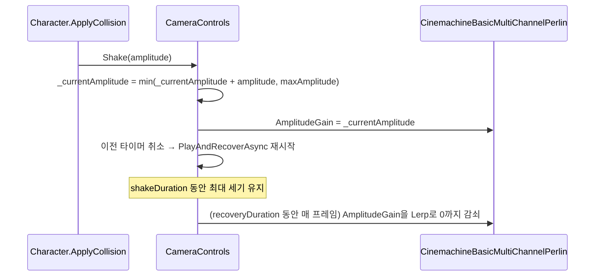

# Camera — 카메라 제어

메인 카메라 경계 계산, 충돌 시 카메라 흔들림(Shake), 스피드 버프에 맞춘 카메라 줌 연출을 담당하는 Stage 범위 서비스입니다.
`MonoBehaviour`가 아닌 순수 C# 클래스로, `StageLifetimeScope`에서 VContainer로 생성·주입됩니다 — 씬 GameObject 없이도 테스트/교체가 쉬운 구조입니다.

> 설계 배경 원문: [ARCHITECTURE.md](ARCHITECTURE.md)
> 상위 문서: [최상위 CLAUDE.md](../../../CLAUDE.md)

## 왜 MonoBehaviour가 아닌가

카메라 제어 로직 자체는 상태(현재 흔들림 세기, 기준 Zoom 값)와 계산만 있으면 되고 Unity 생명주기 콜백이 필요 없습니다. `StageLifetimeScope`가 씬의 `mainCamera`/`vCamera`(`CinemachineCamera`)를 Inspector에서 참조해 생성자 파라미터로 주입하고, `ICameraControls` 인터페이스로 노출해 `Character`, `BuffSystem`, 스폰 액션들이 구현이 아니라 인터페이스에만 의존하도록 합니다.

## 폴더 구조

| 파일 | 역할 |
|---|---|
| [`CameraControls.cs`](CameraControls.cs) | 실사용 구현체 — 경계 계산 / Shake / Speed Boost 줌 전부 여기 |
| [`Interface/ICameraControls.cs`](Interface/ICameraControls.cs) | 외부(Character, BuffSystem, 스폰 액션)가 참조하는 인터페이스 |

## 1. 카메라 경계 계산 — 오브젝트 스폰/디스폰의 기준선

```csharp
OutSideLeftX = 카메라 중심.x - orthographicSize * aspect   // 화면 왼쪽 바깥 경계
InSideLeftX  = 카메라 중심.x + orthographicSize * aspect   // 화면 왼쪽 안쪽 경계 (현재 미사용)
SpawnOffset  = 카메라 중심.x + orthographicSize * aspect * 2  // 화면 오른쪽에서 한 화면 폭 더 앞선 스폰 기준선
```

이 세 값이 실제로 [2D 오브젝트 컬링](../Stage/ARCHITECTURE.md)의 기준선입니다.

- [`ClientMapSpawnAction.SpawnVisibleTiles()`](../Stage/Action/ClientMapSpawnAction.cs) — 타일 왼쪽 끝이 `SpawnOffset`을 넘어서기 전까지만 순서대로 스폰 (미리 정렬돼 있어 맨 앞 하나만 비교)
- [`ClientMapSpawnAction.DespawnOffScreenTiles()`](../Stage/Action/ClientMapSpawnAction.cs) — 타일 오른쪽 끝이 `OutSideLeftX`보다 왼쪽으로 나가면 풀에 반환
- [`ClientEnemySpawnAction.cs`](../Stage/Action/ClientEnemySpawnAction.cs) — 몬스터/오브젝트 스폰도 동일하게 `SpawnOffset` 기준으로 큐에서 꺼냄

`InSideLeftX`는 선언만 되어 있고 현재 호출부가 없습니다 — 화면 안쪽 경계가 필요한 기능(예: 화면 안으로 들어온 시점의 별도 처리)이 생기면 쓰기 위해 미리 만들어둔 것으로 보입니다.

## 2. Camera Shake — 충돌 시 흔들림

`Character`가 Collision으로 데미지를 받을 때(`Status.CameraShake` 스탯 > 0, 맞은 쪽이 Player일 때만) [`ICameraControls.Shake(amplitude)`](Interface/ICameraControls.cs)를 호출합니다.



- **누적 + 상한**: 연속 피격 시 진폭이 더해지되 `cameraShakeMaxAmplitude`를 넘지 않습니다.
- **지속시간 재시작**: 연속 요청이 오면 매번 `cameraShakeDuration` 타이머를 처음부터 다시 시작합니다 (`CancellationTokenSource` 교체 — [Stage 전환 오버레이](../../GUI/ScreenManager/ScreenManager.StageTransition.cs)의 Fade 취소와 동일한 패턴).
- **뚝 끊기지 않는 감쇠**: duration이 끝나면 바로 0이 아니라 `cameraShakeRecoveryDuration` 동안 매 프레임 Lerp로 서서히 감쇠합니다. 감쇠 도중 새 `Shake()`가 오면 토큰이 취소되고 그 시점의 잔여 진폭 위에 새 진폭이 누적되어 자연스럽게 이어집니다.

**Cinemachine 3.x 마이그레이션 주의사항:** CM2의 `CinemachineVirtualCamera`는 Noise 컴포넌트가 숨겨진 child rig에 있어 `GetCinemachineComponent<T>()`로 접근해야 했지만, CM3의 `CinemachineCamera`는 Body/Aim/Noise 같은 파이프라인 컴포넌트가 **같은 GameObject의 sibling 컴포넌트**로 붙는 구조로 바뀌어 `vCamera.GetComponent<CinemachineBasicMultiChannelPerlin>()`로 바로 가져올 수 있습니다. `AmplitudeGain` 필드명은 CM2와 동일하게 유지됩니다.

**씬 설정 요구사항:** `vCamera`에 `CinemachineBasicMultiChannelPerlin` 컴포넌트와 `NoiseSettings` 프로파일이 있어야 합니다. 없으면 생성 시점에 에러 로그만 남기고 Shake는 조용히 무시됩니다. 프로파일은 프로젝트에서 별도로 만든 asset이 아니라 **Cinemachine 패키지가 기본 제공하는 프리셋을 그대로 사용** — `Assets/` 하위에 커스텀 asset이 없는 게 정상입니다.

## 3. Speed Boost 카메라 연출

Speed 버프로 이동속도가 점진적으로 빨라지는 동안([버프 fade 시스템](../Buff/ARCHITECTURE.md)), 같은 fade 진행도로 카메라 시야를 넓히고 캐릭터를 뒤로 밀어내 "빨라지는 느낌"을 화면으로도 표현합니다.

```csharp
// 생성 시점에 기준값 캡처
_baseOrthographicSize = vCamera.Lens.OrthographicSize
_baseFollowOffsetX    = vCamera.GetComponent<CinemachineFollow>().FollowOffset.x

// SetSpeedBoostFade(fadeFactor), fadeFactor: 0(평상시)~1(최대 부스트)
OrthographicSize  = _baseOrthographicSize + cameraBoostZoomAmount    * fadeFactor
FollowOffset.x    = _baseFollowOffsetX    + cameraBoostOffsetXAmount * fadeFactor
```

- 별도 보간 없이 매 프레임 fadeFactor를 그대로 반영 — Buff의 fadeIn/fadeOut 곡선을 그대로 따라갑니다.
- **호출 주체는 `BuffSystem`이지 `Character`가 아닙니다.** Speed 보너스와 fade factor를 이미 [`BuffSystem.NotifySpeedFade()`](../Buff/System/BuffSystem.cs)가 계산하고 있어서, 카메라 연출 트리거도 그 계산이 일어나는 자리에 두는 편이 로직이 여러 파일로 쪼개지지 않아 자연스럽습니다. 자세한 배경은 [Buff/ARCHITECTURE.md의 "카메라 연출 연동"](../Buff/ARCHITECTURE.md) 참고.
- `CinemachineFollow`도 Noise와 같은 CM3 sibling 컴포넌트 패턴이라 `vCamera.GetComponent<CinemachineFollow>()`로 바로 가져옵니다.
- `vCamera.Lens`는 `LensSettings` **구조체 필드**(프로퍼티 아님)라 `Lens.OrthographicSize = x`처럼 직접 대입해도 동작은 하지만, 구현에서는 읽고 → 수정 → 재대입하는 패턴(`var lens = vCamera.Lens; lens.X = ...; vCamera.Lens = lens;`)을 사용합니다 — Cinemachine API가 필드/프로퍼티 중 무엇으로 바뀌어도 안전한 관용구입니다.

## 연관 문서 / 코드

- [ARCHITECTURE.md](ARCHITECTURE.md) — 설계 원칙 원문, `StageLifetimeScope` 등록 코드 전문
- [`Character.Action.cs`](../Character/Character.Action.cs) — `ApplyCollision()` / `ApplyCameraShake()`
- [`BuffSystem.cs`](../Buff/System/BuffSystem.cs) — `NotifySpeedFade()` / `Initialize()` / `Release()`
- [`Character.Buff.cs`](../Character/Character.Buff.cs) — `InitializeBuff()`에서 Player일 때만 `CameraControls` 전달
- [`ClientMapSpawnAction.cs`](../Stage/Action/ClientMapSpawnAction.cs), [`ClientEnemySpawnAction.cs`](../Stage/Action/ClientEnemySpawnAction.cs) — 카메라 경계 기반 스폰/디스폰
- [`StageLifetimeScope.cs`](../../LifetimeScope/StageLifetimeScope.cs) — 등록 및 튜닝 파라미터
- Shake용 NoiseSettings 프로파일 — Cinemachine 패키지 기본 제공 프리셋 사용, 프로젝트 자체 asset 아님
