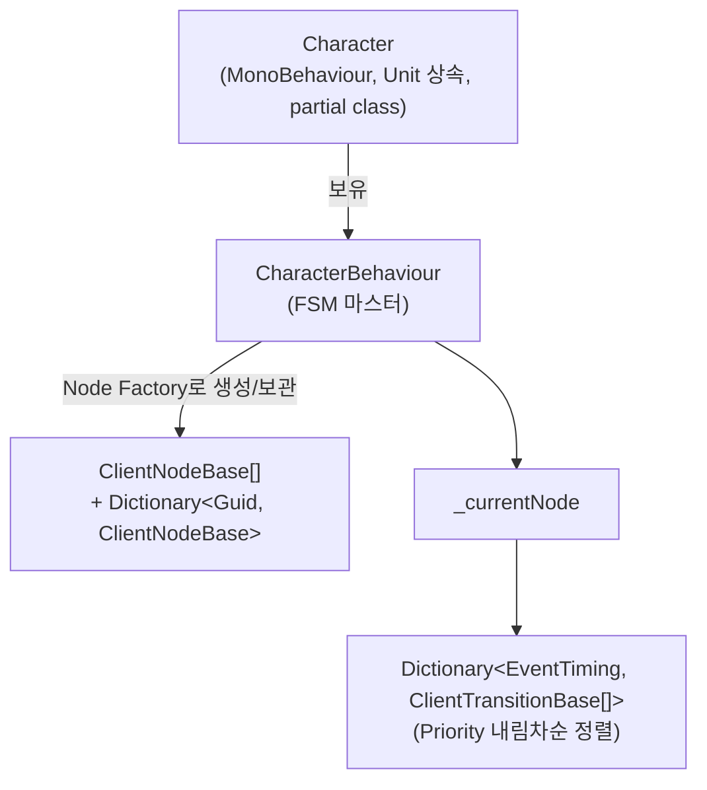
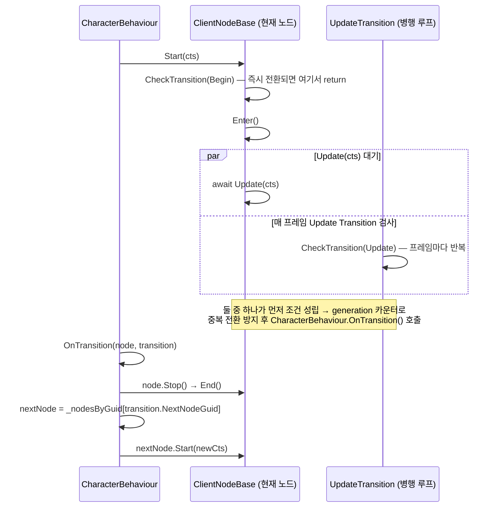

# GamePlay/Character — 캐릭터 클라이언트 런타임

`GameInfo/Character`의 기획 데이터(노드/전환 정의)를 읽어 **UniTask 기반 비동기 FSM**으로 실제 캐릭터 동작을 구현하는 계층입니다. VContainer, UniTask, R3, ECS 등 Unity 전용 라이브러리를 자유롭게 사용합니다.

> 상세 설계 문서 (FSM 실행 흐름, Node/Transition 추가 템플릿 전문): [ARCHITECTURE.md](ARCHITECTURE.md)
> 상위 문서: [GamePlay/ARCHITECTURE.md](../ARCHITECTURE.md) · [최상위 CLAUDE.md](../../../../CLAUDE.md)

```
GameInfo/Character  (기획 데이터, 불변 정의, Unity 비의존)
       ↓ Factory (ClassPool.Get<ClientXxx>().Initialize(...))
GamePlay/Character  ← 이 계층 (Client 런타임 구현)
```

## 전체 구조



캐릭터 하나가 스폰되면 `Character.Initialize()` → `CharacterBehaviour.Initialize(BehaviourInfo, this)`가 `BehaviourInfo.nodes[]`를 전부 `ClientNodeBase` 인스턴스로 변환해 보관하고, `StartAsync()` 호출 시 `StartNode`부터 FSM이 시작됩니다.

## Character — 메인 MonoBehaviour (Partial Class)

관심사별로 파일을 분리했습니다.

| 파일 | 담당 | 링크 |
|---|---|---|
| `Character.cs` | 진입점 — `Initialize`/`Release`/`StartAsync`, `IPoolMember` 구현 | [Character.cs](Character.cs) |
| `Character.GameInfo.cs` | `CharacterInfo`/`BehaviourInfo` 지연 조회 (uid 캐시) | [Character.GameInfo.cs](Character.GameInfo.cs) |
| `Character.Injection.cs` | VContainer `[Inject]` 의존성 (StageManager, PlayerControls, AudioManager 등) | [Character.Injection.cs](Character.Injection.cs) |
| `Character.ReactiveProperty.cs` | `State` ReactiveProperty + 파생 bool 프로퍼티, 초기 구독 설정 | [Character.ReactiveProperty.cs](Character.ReactiveProperty.cs) |
| `Character.State.cs` | `SetState`/`AddState`/`RemoveState` (Flags 비트 연산) | [Character.State.cs](Character.State.cs) |
| `Character.GamePlay.cs` | Spine 애니메이션, `Status`, `CharacterBehaviour` 생성 | [Character.GamePlay.cs](Character.GamePlay.cs) |
| `Character.Action.cs` | 충돌 처리, 이동/점프 ECS 데이터 동기화, 애니메이션 재생 | [Character.Action.cs](Character.Action.cs) |
| `Character.Buff.cs` | `IBuffOwner` 구현, 버프 적용/속도 fade 반영 | [Character.Buff.cs](Character.Buff.cs) |
| `Character.Entities.cs` | ECS Entity에 필요한 Component/Buffer 부착 (`EnsureComponents`) | [Character.Entities.cs](Character.Entities.cs) |
| `Character.Gizmos.cs` | 에디터 전용 히트박스 Gizmos 편집 도구 (`#if UNITY_EDITOR`) | [Character.Gizmos.cs](Character.Gizmos.cs) |
| `Interface/ICharacter.cs` | `Character`의 공개 인터페이스 | [Interface/ICharacter.cs](Interface/ICharacter.cs) |

### 초기화 순서

```csharp
Initialize(team, isPlayer)
  SetState(None)
  _unitManager.RegisterUnit(this, team)   // ECS Entity 생성 (UnitManager)
  InitializeEntity()                      // ECS Component/Buffer 부착
  InitializeGamePlay()                    // CharacterBehaviour 생성 + Initialize(BehaviourInfo, this)
  InitializeAction()                      // Status 계산, FallingData 초기화
  InitializeBuff()                        // BuffSystem 생성
  InitializeReactiveProperty()            // 반드시 마지막 — 다른 필드가 준비된 뒤 구독 시작
  AddState(Initialized)

StartAsync()
  CharacterBehaviour.Start()              // FSM 진입 (StartNode부터)
```

### ReactiveProperty 상태 체계

```csharp
ReactiveProperty<CharacterState> State   // 비트 플래그 마스터 상태

// State에서 파생 (R3 Select + DistinctUntilChanged)
Initialized, Running, Jumping, Die, SystemControl, CollisionState, OutSideMap, InSideMap
```

- Node/Transition은 `Character.Die.CurrentValue`처럼 파생 프로퍼티를 읽어 조건을 판별합니다.
- `State.Subscribe(SyncHitbox)` — 상태가 바뀔 때마다 `CharacterInfo.OrderedHitboxes`에서 현재 상태에 맞는 히트박스를 ECS `HitBoxData`에 반영합니다.
- **대표 사례 — 상태 변화가 오디오까지 직접 트리거하는 패턴**: `Jumping` 구독에서 점프 시작 시 `CharacterInfo.jumpAudio`를 `PlayAsync`, 점프 종료 시 같은 `AudioData`로 `_audioManager.Stop(CharacterInfo.jumpAudio)`를 호출합니다 — 핸들을 들고 있지 않고 key 기준으로 정지하는 `IAudioManager.Stop(AudioData)` 오버로드의 대표 사용처입니다 (상세: [GamePlay/Audio/ARCHITECTURE.md](../Audio/ARCHITECTURE.md)).
- `InSideMap`이 켜지는 순간 `StartAsync()`를 호출해 FSM을 시작합니다 — 즉 스폰 직후가 아니라 **화면 안으로 들어온 시점에 FSM이 시작**되는 구조입니다 ([`Character.ReactiveProperty.cs`](Character.ReactiveProperty.cs)).

## FSM 실행 흐름 — `ClientNodeBase.Start()`

`Enter → Update`가 끝난 뒤에 순차적으로 Transition을 검사하는 구조가 아니라, **`Update(cts)`를 기다리는 동안 별도 루프가 매 프레임 `EventTiming.Update` Transition을 병행 검사**합니다. 둘 중 먼저 조건이 맞는 쪽이 전환을 트리거합니다 ([`Node/ClientNodeBase.cs`](Node/ClientNodeBase.cs) `Start()`/`UpdateTransition()`).



`nodeGeneration` 카운터로 "이미 다른 경로로 전환이 시작된 노드"가 뒤늦게 또 전환을 발동시키는 경쟁 상태를 막습니다.

## Node / Transition Factory — switch 기반 (CodeGen 아님)

`Stage/Action`·`Stage/Trigger`와 달리 이 폴더는 **CodeGenerator 없이 수동 `switch` 문**으로 타입을 매핑합니다. 새 Node/Transition을 추가하면 아래 두 switch에 분기를 직접 추가해야 합니다.

- `CharacterBehaviour.Create()` ([`Behaviour/CharacterBehaviour.cs`](Behaviour/CharacterBehaviour.cs)) — `NodeBase` → `ClientNodeBase`
- `ClientNodeBase.Create()` ([`Node/ClientNodeBase.cs`](Node/ClientNodeBase.cs), private static) — `TransitionBase` → `ClientTransitionBase`

두 Factory 모두 `ClassPool.Get<T>().Initialize(...)`로 인스턴스를 재사용합니다.

### 구체 Node 구현 ([`Node/`](Node/))

| 클래스 | Enter() | Update() | 링크 |
|---|---|---|---|
| `ClientStartNode` | — | 즉시 종료 | [ClientStartNode.cs](Node/ClientStartNode.cs) |
| `ClientWaitNode` | `AddState(Idling)` + IDLE 애니 | 즉시 종료 | [ClientWaitNode.cs](Node/ClientWaitNode.cs) |
| `ClientRunNode` | `AddState(Running)` + RUN 애니 | 즉시 종료 | [ClientRunNode.cs](Node/ClientRunNode.cs) |
| `ClientDieNode` | `RemoveState(Running)` | DIE 애니 → `DieAnimation` 재생 → 제거 대기 | [ClientDieNode.cs](Node/ClientDieNode.cs) |
| `ClientPlayerControlNode` | 점프 상태 설정 | 입력이 있는 동안 점프 ECS 동기화 루프 | [ClientPlayerControlNode.cs](Node/ClientPlayerControlNode.cs) |
| `ClientSystemControlNode` | `RemoveState(Running)` | `SystemControl == false`까지 대기 | [ClientSystemControlNode.cs](Node/ClientSystemControlNode.cs) |
| `ClientCollisionNode` | `RemoveState(Running)` + 점프 정지 | DAMAGE 애니 재생 → `RemoveState(Collision)` | [ClientCollisionNode.cs](Node/ClientCollisionNode.cs) |
| `ClientNodeBase` | — | (abstract, 공통 FSM 루프) | [ClientNodeBase.cs](Node/ClientNodeBase.cs) |

### 구체 Transition 구현 ([`Transition/`](Transition/))

| 클래스 | `OnTrigger()` 조건 | 링크 |
|---|---|---|
| `ClientPlayerControl` | `PlayerControls.HasAnyInput == Value` (플레이어 전용) | [ClientPlayerControl.cs](Transition/ClientPlayerControl.cs) |
| `ClientSystemControl` | `Character.SystemControl.CurrentValue == Value` | [ClientSystemControl.cs](Transition/ClientSystemControl.cs) |
| `ClientEndTransition` | 항상 `true` (무조건 전환) | [ClientEndTransition.cs](Transition/ClientEndTransition.cs) |
| `ClientDieTransition` | `Character.Die.CurrentValue == Value` | [ClientDieTransition.cs](Transition/ClientDieTransition.cs) |
| `ClientCollisionTransition` | `Character.CollisionState.CurrentValue == Value` | [ClientCollisionTransition.cs](Transition/ClientCollisionTransition.cs) |
| `ClientTransitionBase` | (abstract, 공통 베이스) | [ClientTransitionBase.cs](Transition/ClientTransitionBase.cs) |

**`IClassPool` 필수 구현:** 모든 `ClientXxxNode`/`ClientXxxTransition`은 `OnRent()`/`OnReturn()`을 구현하고, `OnReturn()`에서 보유 참조를 반드시 `null`로 초기화해야 합니다 (GC 누수 방지 — `ClassPool`이 인스턴스를 재사용하기 때문).

## 그 외 폴더

| 폴더 | 역할 | 링크 |
|---|---|---|
| `Behaviour/` | FSM 마스터 (`CharacterBehaviour`) | [CharacterBehaviour.cs](Behaviour/CharacterBehaviour.cs) |
| `Animation/` | 죽음 연출 베이스/구현. `DieAnimation`은 캐릭터마다 다른 연출을 위한 추상 클래스 | [DieAnimation.cs](Animation/DieAnimation.cs), [ObstacleDieAnimation.cs](Animation/ObstacleDieAnimation.cs) (DOTween 페이드) |
| `Interface/Enum/` | Spine 애니메이션 이름 상수 | [AnimationName.cs](Interface/Enum/AnimationName.cs) |
| `Input/` | Unity Input System 자동 생성 코드 (수정 금지 — `<auto-generated>`) | [PlayerControlMap.cs](Input/PlayerControlMap.cs) |
| `SpineEditor.cs` | Spine 애니메이션 미리보기용 에디터 도구 (`ExecuteInEditMode`, 타임라인 스크럽) | [SpineEditor.cs](SpineEditor.cs) |

## 새 Node / Transition 추가 방법 (요약)

전체 템플릿과 예시 코드는 [ARCHITECTURE.md](ARCHITECTURE.md#새-node--transition-추가-방법)에 있습니다.

1. `GameInfo/Character/Node|Transition/XxxNode.cs` — 기획 데이터 클래스 (`NodeBase`/`TransitionBase` 상속)
2. `GamePlay/Character/Node|Transition/ClientXxxNode.cs` — `ClientNodeBase`/`ClientTransitionBase` + `IClassPool` 구현
3. `CharacterBehaviour.Create()` 또는 `ClientNodeBase.Create()`의 switch에 분기 추가 (자동 생성 아님, 수동 등록 필수)

## 연관 문서 / 코드

- [ARCHITECTURE.md](ARCHITECTURE.md) — 이 폴더의 원본 설계 문서 (FSM 상세 흐름, 템플릿 전문)
- [GameInfo/Character/](../../GameInfo/Character/) — 이 계층이 읽는 기획 데이터 원본
- [GamePlay/ECS/README.md](../ECS/README.md) — `Character`가 매 프레임 동기화하는 이동/점프/충돌 ECS 시스템
- [Buff/System/BuffSystem.cs](../Buff/System/BuffSystem.cs) — `Character.Buff.cs`가 생성/구동하는 버프 시스템
- [Stat/Status.cs](../Stat/Status.cs) — `Character.Status`가 보관하는 런타임 스탯
- [GamePlay/Audio/ARCHITECTURE.md](../Audio/ARCHITECTURE.md) — 점프/피격 사운드 재생 구조
