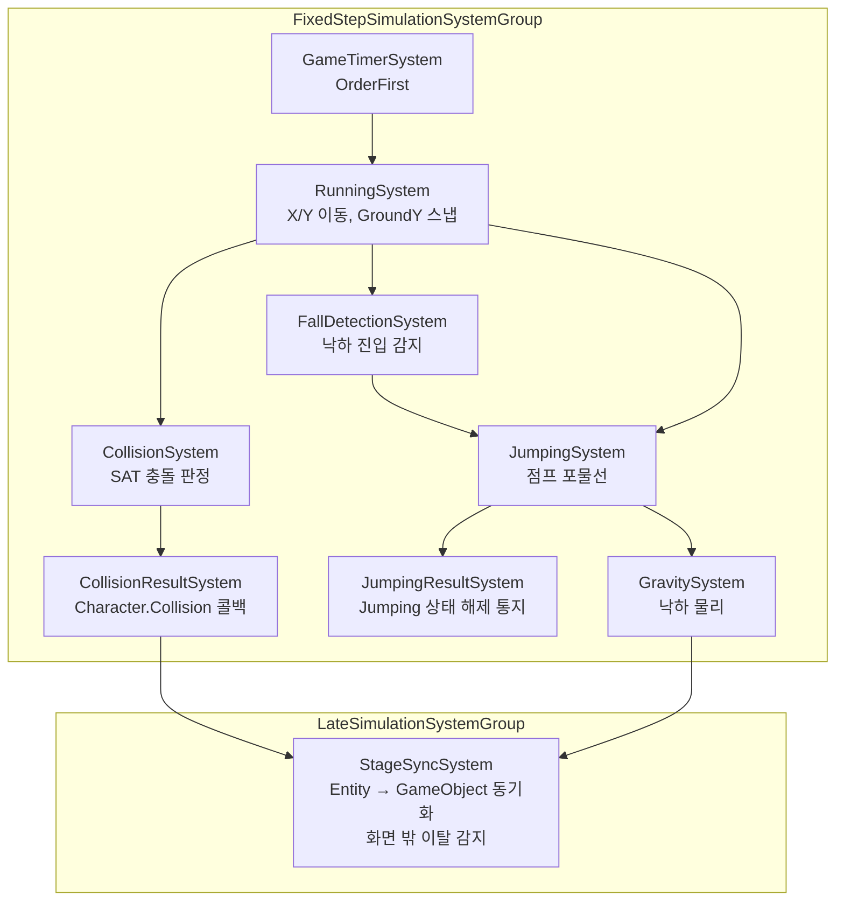

# ECS — 이동 / 점프 / 충돌 물리 시스템

이 폴더는 캐릭터의 **이동, 낙하, 점프, 충돌 판정**을 [Unity DOTS(Entities)](https://docs.unity3d.com/Packages/com.unity.entities@latest) 기반으로 구현한 코드입니다.
게임 로직 대부분은 `MonoBehaviour` + FSM(`Character/Node`, `Character/Transition`)으로 짜여 있지만, **매 프레임 다수 유닛에 반복 적용되는 물리 연산**만 이 ECS 월드로 분리해 Burst 컴파일 + Job System으로 처리합니다.

> 상위 문서: [GamePlay/ARCHITECTURE.md](../ARCHITECTURE.md) · 프로젝트 전체 구조: [최상위 CLAUDE.md](../../../../CLAUDE.md)

## 왜 이 부분만 ECS인가

- 이동/낙하/점프/충돌은 **유닛 수에 비례해 매 FixedStep마다 반복**되는 순수 연산이라 Burst + `IJobEntity` 병렬화의 이득이 가장 큰 영역입니다.
- 반면 상태 전이, 연출, 사운드처럼 분기가 많고 1회성인 로직은 FSM(`ClientXxxNode`/`ClientXxxTransition`)에 그대로 남겨, ECS는 **"물리 연산 전용 하위 레이어"** 로 한정했습니다.
- `MonoBehaviour`([`Unit`](../Unit/Unit/Unit.cs))와 ECS `Entity`는 [`UnitManager`](../Unit/Manager/UnitManager.cs)가 1:1로 연결하고, 매 프레임 [`StageSyncSystem`](System/StageSyncSystem.cs)이 계산 결과를 다시 `Transform`에 반영하는 **단방향 동기화 구조**입니다.

```
Unit (MonoBehaviour) --RegisterUnit()--> UnitManager --CreateEntity()--> ECS Entity
                                                                              │
                                                        FixedStepSimulationSystemGroup
                                                                              │
GameObject.transform  <---StageSyncSystem (LateSimulationSystemGroup)--- LocalTransform
```

## 폴더 구조

| 폴더 | 역할 | 링크 |
|---|---|---|
| `World/` | ECS `World` 생성/해제, PlayerLoop 등록 | [World/StageEntityWorld.cs](World/StageEntityWorld.cs) |
| `World/Interface/` | World 접근용 DI 인터페이스 | [World/Interface/IStageEntityWorld.cs](World/Interface/IStageEntityWorld.cs) |
| `Component/` | `IComponentData` / `IBufferElementData` 정의 | [Component/](Component/) |
| `System/` | `ISystem` / `SystemBase` 구현 (실제 로직) | [System/](System/) |

## World 초기화 — [`StageEntityWorld.cs`](World/StageEntityWorld.cs)

VContainer의 `IInitializable`로 등록되어 Stage 진입 시 초기화됩니다. Unity의 `DefaultWorldInitialization`을 쓰지 않고, **필요한 시스템만 수동으로 나열**해 루트 그룹에 등록합니다 (`[DisableAutoCreation]`이 모든 시스템에 붙어있는 이유이기도 합니다).

```csharp
// StageEntityWorld.Initialize() 내부 등록 순서
GameTimerSystem → RunningSystem → FallDetectionSystem → JumpingSystem
    → GravitySystem → JumpingResultSystem → CollisionSystem
    → CollisionResultSystem → StageSyncSystem
```

`Dispose()`에서 `ScriptBehaviourUpdateOrder.RemoveWorldFromCurrentPlayerLoop` + `_world.Dispose()`로 PlayerLoop 등록을 반드시 해제합니다 — 씬 전환 시 좀비 World가 남아 다음 스테이지에서 중복 갱신되는 것을 막기 위함입니다.

## 실행 순서 (System Dependency Graph)



## Component — 데이터 정의

| Component | 종류 | 설명 | 링크 |
|---|---|---|---|
| `EGameTimer` | Singleton | ECS 월드 전용 경과 시간 (`Elapsed`/`Delta`), `IsPaused`로 일시정지 | [Component/EGameTimer.cs](Component/EGameTimer.cs) |
| `MapGroundData` | Singleton | 현재 맵의 바닥 Y(`GroundY`)와 구간별 낙사 라인(`FallDeathY`) | [Component/MapGroundData.cs](Component/MapGroundData.cs) |
| `CameraData` | Singleton | `StageSyncSystem`이 화면 좌/우 경계를 계산할 때 참조하는 카메라 참조 | [Component/Camera.Component.cs](Component/Camera.Component.cs) |
| `UnitData` | Data | Uid/Team/원본 `GameObject`/`IsPlayer` 등 유닛 식별 정보 | [Component/Unit.Component.cs](Component/Unit.Component.cs) |
| `HitBoxData` | Data | 충돌 판정용 형상(Rect/Circle), `GameInfo`의 [`Hitbox`](../../GameInfo/Character/Hitbox/Base/Hitbox.cs)로부터 변환 | [Component/Unit.Component.cs](Component/Unit.Component.cs) |
| `RunningData` | Data | 이동 방향/속도 | [Component/Unit.Component.cs](Component/Unit.Component.cs) |
| `JumpInputData` | Data | 점프 입력 (Held, 가변 점프 높이용) | [Component/Unit.Component.cs](Component/Unit.Component.cs) |
| `JumpingData` | Data | 점프 진행 상태 (Timer, JumpVelocity, RiseSpeed, MaxJumpTime 등) | [Component/Unit.Component.cs](Component/Unit.Component.cs) |
| `FallingData` | Data | 낙하 속도/중력 계수 | [Component/Unit.Component.cs](Component/Unit.Component.cs) |
| `UnitCollisionResult` | Buffer | 이번 프레임 충돌 상대 목록 (`DynamicBuffer`) | [Component/Unit.Component.cs](Component/Unit.Component.cs) |
| `UnitCollisionDelay` | Buffer | 상대별 재충돌 방지 쿨다운 만료 시각 | [Component/Unit.Component.cs](Component/Unit.Component.cs) |
| `UnitXxxEnable` | Tag (`IEnableableComponent`) | `Die`/`Running`/`Jumping`/`Falling`/`Collision`/`CollisionResult`/`SystemControl` — 상태 스위치 | [Component/Unit.Component.cs](Component/Unit.Component.cs) |

**설계 포인트 — `IEnableableComponent`를 상태 스위치로 사용**
개별 유닛의 "지금 점프 중인가/낙하 중인가"를 `bool` 필드가 아니라 `IEnableableComponent`(Enableable Tag)로 표현합니다. 구조 변경(archetype change) 없이 컴포넌트를 켜고 끌 수 있어, 각 System의 Query에서 `.WithDisabled<UnitJumpingEnable>()` 처럼 **"이 상태가 아닌 유닛만"** 걸러내는 비용이 거의 0에 가깝습니다.

## System — 프레임별 실행 로직

| System | 실행 그룹 / 순서 | 역할 | 링크 |
|---|---|---|---|
| `GameTimerSystem` | FixedStep, `OrderFirst` | `EGameTimer` 싱글톤 생성 및 매 프레임 갱신 (일시정지 지원) | [System/GameTimerSystem.cs](System/GameTimerSystem.cs) |
| `RunningSystem` | FixedStep | X/Y 방향 이동 적용, 낙사 구간(`FallDeathY`)에서 X 이동 차단, `GroundY` 상승 시 오르막 스냅 | [System/RunningSystem.cs](System/RunningSystem.cs) |
| `FallDetectionSystem` | FixedStep, After Running / Before Jumping | 점프 중이 아닌데 `GroundY`보다 높이 떠 있으면 `UnitFallingEnable` 켜서 낙하 개시 | [System/FallDetectionSystem.cs](System/FallDetectionSystem.cs) |
| `JumpingSystem` | FixedStep, After Running | 가변 점프(Held 유지 시간에 비례한 점프 높이) 포물선 계산, 낙사 구간 점프 시작 차단 | [System/JumpingSystem.cs](System/JumpingSystem.cs) |
| `GravitySystem` | FixedStep, After Jumping | 낙하 가속도 적용, 착지 시 `UnitFallingEnable` 해제 | [System/GravitySystem.cs](System/GravitySystem.cs) |
| `JumpingResultSystem` | FixedStep, After Jumping | `UnitJumpingEnable`이 꺼진 유닛을 찾아 FSM(`Character.RemoveState(Jumping)`)에 결과 통지 | [System/JumpingResultSystem.cs](System/JumpingResultSystem.cs) |
| `CollisionSystem` | FixedStep, After Running | 전체 유닛 O(N²) 충돌 판정(SAT: Rect-Rect / Circle-Circle / Rect-Circle), 팀 필터링 + 쿨다운 버퍼 기록 | [System/CollisionSystem.cs](System/CollisionSystem.cs) |
| `CollisionResultSystem` | FixedStep, After Collision | 충돌 결과 버퍼를 순회하며 `Character.Collision(otherUid)` 콜백 호출 후 버퍼 비움 | [System/CollisionResultSystem.cs](System/CollisionResultSystem.cs) |
| `StageSyncSystem` | LateSimulation | ECS `LocalTransform` → 원본 `GameObject.transform` 반영, 화면 좌/우 이탈 시 FSM에 `InSideMap`/`OutSideMap` 상태 추가 | [System/StageSyncSystem.cs](System/StageSyncSystem.cs) |

### 점프 — 가변 높이(Variable Jump Height)
`JumpingSystem`은 `Held`가 유지되고 `Timer < MaxJumpTime`인 동안 `RiseSpeed`(= `Status.Jump / MaxJumpTime`)로 등속 상승시켜, 버튼을 `MaxJumpTime`만큼 누르고 있으면 정확히 `Status.Jump` 높이에 도달합니다. 버튼을 떼거나 `MaxJumpTime`을 넘는 순간 `JumpVelocity`에 `Gravity * FallGravity`가 매 틱 감산되며 낙하로 전환되어, "짧게 누르면 낮게, 길게 누르면 높게" 점프감을 만듭니다.

### 충돌 — 재충돌 쿨다운
`CollisionSystem`은 매 프레임 전체 유닛을 순회하는 `O(N²)` 판정이지만, `[BurstCompile]` + `ScheduleParallelByRef`로 병렬화되어 있습니다. 한 번 충돌한 상대는 `UnitCollisionDelay` 버퍼에 만료 시각을 기록해, 겹쳐 있는 동안 매 프레임 콜백이 반복 발생하지 않도록 합니다.

### 낙사(Fall Death) — X 이동 차단 방식
`MapGroundData.FallDeathY`는 구간별로 달라질 수 있는 낙사 라인입니다. 캐릭터를 즉시 죽이는 대신, **플레이어가 `FallDeathY` 이하로 떨어지면 `RunningSystem`/`JumpingSystem`이 X 방향 이동·점프 시작을 막아** 화면 밖으로 더 이상 진행하지 못하게만 하는 방식입니다. 실제 사망 판정은 이 폴더 밖(맵 낙사 트리거)에서 처리됩니다.

## 관련 문서 / 코드

- [GamePlay/ARCHITECTURE.md](../ARCHITECTURE.md) — GamePlay 전체 디자인 패턴 (Factory, FSM, ECS, Object Pool)
- [Unit/Manager/UnitManager.cs](../Unit/Manager/UnitManager.cs) — `MonoBehaviour` ↔ ECS `Entity` 등록/해제
- [Character/Character.cs](../Character/Character.cs) — ECS 결과(충돌, 점프 종료)를 최종 수신하는 FSM 캐릭터 본체
