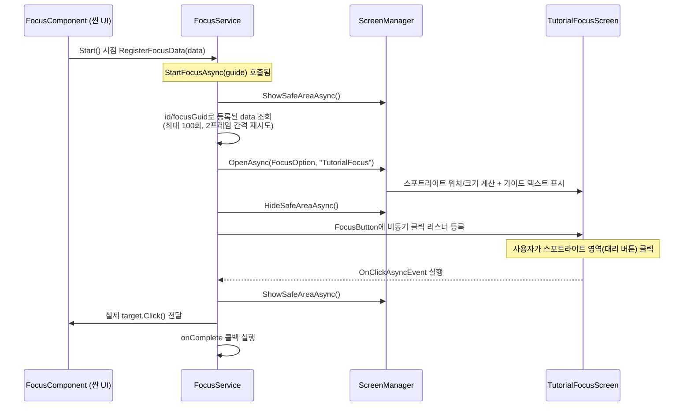

# Tutorial/Focus — 튜토리얼 스포트라이트 시스템

씬 위의 특정 UI 요소(버튼/이미지/토글)에 스포트라이트를 비추고 가이드 텍스트를 보여준 뒤, **그 요소를 실제로 클릭해야** 다음 단계로 넘어가는 온보딩 튜토리얼 시스템입니다. 기존에는 `TutorialFocus.cs`(MonoBehaviour 단일 클래스, 346줄)가 Screen 관리 시스템 바깥에서 독자적으로 UI를 그리고 있었는데, 이번에 [`Assets/Script/GUI/`](../../GUI/README.md)의 Screen/Layer/캐싱 정책을 그대로 따르도록 `FocusService` + `TutorialFocusScreen` + `FocusComponent` 조합으로 다시 설계했습니다.

> 설계 배경 원문: [ARCHITECTURE.md](ARCHITECTURE.md)
> 상위 문서: [GamePlay/ARCHITECTURE.md](../ARCHITECTURE.md) · [최상위 CLAUDE.md](../../../../CLAUDE.md)

## 전체 흐름



## 1. 등록 — `FocusComponent`

씬에 배치된 버튼/이미지/토글에 붙이는 컴포넌트입니다. `Start()` 시점에 `IFocusService.RegisterFocusData()`로 자기 자신을 등록하고 `OnDestroy()`에서 해제합니다. `type`([`FocusType`](Data/TutorialFocusData.cs) — `Button`/`Image`/`Toggle`)에 따라 `target`이 비어 있으면 같은 GameObject에서 [`SW_GUI_BUTTON_BASE`](../../GUI/SW_GUI/README.md)/`Image`/`SW_GUI_TOGGLE_BASE`를 자동으로 찾아 채우므로, 인스펙터에서 수동으로 연결할 필요가 없습니다.

`sizeOffset`/`positionOffset`으로 스포트라이트 크기·위치를 실제 RectTransform보다 크거나 작게 미세 조정할 수 있고, `showGizmos`를 켜면 `OnDrawGizmos()`가 씬 뷰에 실제 스포트라이트 영역을 노란 사각형으로 미리 그려줍니다.

## 2. 기획 데이터 — 어떤 스텝을 언제 보여줄지

| 클래스 | 역할 |
|---|---|
| [`TutorialInfo`](../../GameInfo/Tutorial/TutorialInfo.cs) | 테이블 자동 생성 대상. `GuideBase[] sets`로 튜토리얼 한 세트를 순서대로 정의 |
| [`GuideBase`](../../GameInfo/Tutorial/GuideBase.cs) | 가이드 공통 필드(`id`, `delayTime`, `fadeInTime`, `fadeOutTime`)만 가진 추상 클래스 — "현재는 Focus만 존재"(코드 주석)하지만 다른 가이드 타입으로 확장 가능하도록 분리해 둠 |
| [`FocusGuide`](../../GameInfo/Tutorial/FocusGuide.cs) | `GuideBase` 구현체. `focusGuid`([`[Focus]`](../../GameInfo/Attribute/FocusAttribute.cs) 어트리뷰트로 인스펙터에서 등록된 대상을 드롭다운 선택), `guideText`, `iconPath`, `flip` |

대상 매칭은 `FocusService.GetFocusData()`가 **`id` 우선, 없으면 `focusGuid`** 순으로 조회합니다.

## 3. 진행 — `FocusService.StartFocusAsync()`

```csharp
await _focusService.StartFocusAsync(focusGuide, onComplete: () => {
    _focusService.StopFocusAsync(true);
});
```

1. `ShowSafeAreaAsync()` — 전환 중 다른 곳 클릭 방지
2. 대상 `TutorialFocusData`를 **최대 100회, 2프레임 간격**으로 재시도 조회 — `StartFocusAsync` 호출 시점에 대상 UI가 아직 로딩/오픈 중이라 `FocusComponent.Start()`(등록)가 안 끝났을 수 있는 타이밍 문제를 흡수하기 위함. 100회 재시도 후에도 못 찾으면 스포트라이트 없이 그냥 `onComplete`만 호출하고 넘어갑니다 — 대상이 씬에 없다고 튜토리얼 전체가 멈추지 않도록 하는 안전장치입니다.
3. `ScreenManager.OpenAsync()`로 `TutorialFocusScreen`을 열고 `HideSafeAreaAsync()`
4. `FocusType`별로 완료 조건을 겁니다.

## 4. 완료 조건 — `FocusType`별 분기

| FocusType | 완료 조건 |
|---|---|
| `Button` | 클릭 시 실제 `target.Click()`을 대신 호출 |
| `Toggle` | 클릭 시 실제 `target.OnClick()`(토글 반전)을 호출 |
| `Image` / `None` | 스포트라이트 영역 클릭 자체가 완료 조건 |

**왜 대상을 직접 클릭 가능하게 두지 않고 대리 버튼을 쓰는가:** `TutorialFocusScreen`은 `Tutorial` Layer(다른 화면들보다 위)에서 렌더링되고, 실제 대상 버튼은 그 아래 레이어에 그대로 남아 있습니다. 마스크 위에 대상과 정확히 같은 크기/위치로 겹쳐지는 투명 `FocusButton`을 두고 그걸 클릭점으로 삼아야 레이어 순서와 무관하게 안정적으로 입력을 받을 수 있습니다.

```csharp
// FocusService.SetFocusCompleteCallBack() 발췌
async UniTask OnClickAsyncEvent() {
    await SafeArea(true);
    _focus.FocusButton.RemoveClickAsyncListener(OnClickAsyncEvent);
    btn.Click();               // 실제 대상 버튼으로 클릭 전달
    OnCompleteEvent();
    _focus.SetButton(false);
}
_focus.FocusButton.AddClickAsyncListener(OnClickAsyncEvent, false);
```

이 비동기 클릭 리스너(`AddClickAsyncListener`)는 [SW_GUI](../../GUI/SW_GUI/README.md#click의-비동기-버전--addclickasynclistener)에 이 시스템을 위해 새로 추가된 API입니다. `useGard`(TutorialFocusData)를 끄면 `SetGardAlpha(false)`로 마스크를 투명하게 만들어 스포트라이트 연출 없이 클릭만 가로채는 것도 가능합니다.

## 5. 렌더링 — `TutorialFocusScreen`

4개의 RectTransform(`top`/`bottom`/`left`/`right`)으로 "가운데만 뚫린 어두운 마스크"를 만듭니다. 별도 stencil/shader 없이, 대상 `RectTransform`의 world position/size를 기준으로 4개 사각형 조각의 `sizeDelta`/`offsetMin`/`offsetMax`를 매 프레임 재계산하는 방식이라 대상이 애니메이션이나 리스트 스크롤로 움직여도 스포트라이트가 따라갑니다. 가이드 텍스트 말풍선은 스포트라이트 위/아래, 화면 밖으로 넘치지 않게 좌우로 클램프해서 배치됩니다.

## 6. SafeArea 연동

스텝 전환마다(스포트라이트 준비 중, 대상 클릭 처리 중) `ShowSafeAreaAsync()`/`HideSafeAreaAsync()`를 짝지어 호출해 사용자가 엉뚱한 곳을 누르지 못하게 막습니다. `SafeArea` Screen 자체에 5초 자동 복구 워치독이 있어서, 이 짝을 맞추는 걸 실수로 빼먹어도 입력이 영구히 막히지는 않습니다 (자세한 내용: [GUI/README.md](../../GUI/README.md#safearea--입력-차단--자동-복구-워치독)).

## 파일 구조

| 경로 | 역할 |
|---|---|
| [`FocusComponent.cs`](FocusComponent.cs) | 씬 배치용 등록 컴포넌트 |
| [`FocusTest.cs`](FocusTest.cs) | 디버그 테스트 트리거 (아래 "아직 비어있는 부분" 참고) |
| [`Data/TutorialFocusData.cs`](Data/TutorialFocusData.cs) | 등록되는 대상 정보 + `FocusType` enum |
| [`Interface/ITutorialFocus.cs`](Interface/ITutorialFocus.cs) | `TutorialFocusScreen`이 구현하는 인터페이스 |
| [`Editor/TutorialFocusDataManager.cs`](Editor/TutorialFocusDataManager.cs) | 에디터 전용 관리 도구 |
| [`../Service/FocusService.cs`](../Service/FocusService.cs) / [`Interface/IFocusService.cs`](../Service/Interface/IFocusService.cs) | 오케스트레이션 |
| [`../../GUI/Screen/Tutorial/TutorialFocusScreen.cs`](../../GUI/Screen/Tutorial/TutorialFocusScreen.cs) | 스포트라이트/가이드 렌더링 |
| [`../../GUI/ScreenOption/FocusOption.cs`](../../GUI/ScreenOption/FocusOption.cs) | `OpenAsync`에 전달하는 파라미터 |
| [`../../GameInfo/Tutorial/`](../../GameInfo/Tutorial/) | `TutorialInfo`/`GuideBase`/`FocusGuide` 기획 데이터 |

## 아직 비어있는 부분

[`FocusTest.cs`](FocusTest.cs)(Odin `[Button]` 디버그 트리거)는 `TutorialInfo.sets`를 순회하며 `await StartFocusAsync(...)`를 호출하는데, `StartFocusAsync`는 **사용자가 실제로 클릭할 때까지 기다리지 않고** 완료 콜백을 걸어둔 뒤 즉시 반환합니다. 즉 이 루프는 각 스텝의 "셋업"만 순서대로 실행할 뿐이고, 다음 반복이 시작되며 이전 스텝의 클릭 리스너를 곧바로 정리해버립니다. 여러 스텝짜리 튜토리얼을 실제로 순차 진행시키려면 `onComplete`를 `await` 가능하게 감싸는 오케스트레이션(예: `UniTaskCompletionSource`)이 추가로 필요합니다.

## 연관 문서 / 코드

- [ARCHITECTURE.md](ARCHITECTURE.md) — 설계 원칙 원문
- [GUI/README.md](../../GUI/README.md) — Screen/Layer/SafeArea 등 상위 시스템
- [GUI/SW_GUI/README.md](../../GUI/SW_GUI/README.md) — 비동기 클릭 이벤트(`AddClickAsyncListener`)
- [`FocusAttributeDrawer.cs`](../../Editor/Attribute/FocusAttributeDrawer.cs) — `[Focus]` 인스펙터 드롭다운 구현
