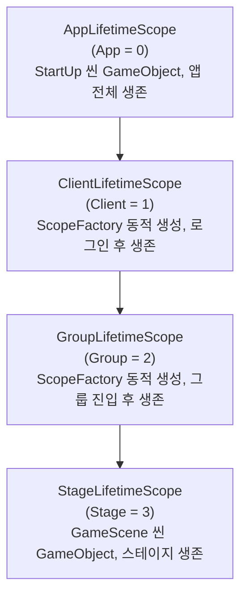
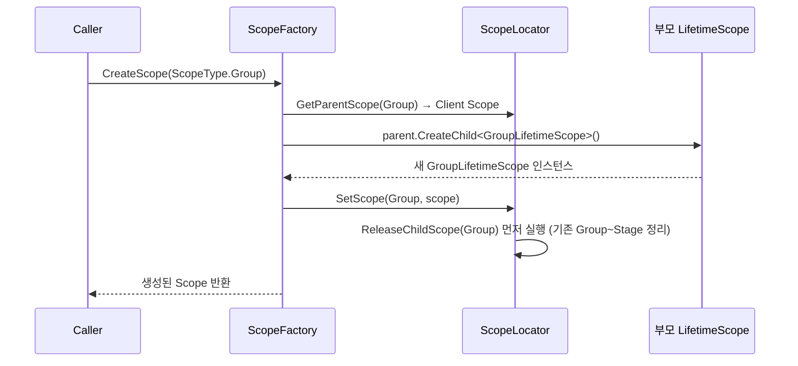

# LifetimeScope — VContainer DI 계층 구조

[VContainer](https://vcontainer.hadashikick.jp/) 기반 의존성 주입 아키텍처입니다. 서비스를 하나의 컨테이너에 몰아넣지 않고, **게임 진행 단계에 맞춰 4단계 Scope 계층**으로 나눠 필요한 시점에 생성하고, 더 이상 필요 없어지면 그 시점에 정확히 파괴합니다.

> 상세 설계 문서: [ARCHITECTURE.md](ARCHITECTURE.md)
> 상위 문서: [최상위 CLAUDE.md](../../../CLAUDE.md)

## 왜 Scope를 4단계로 나눴는가

로그인 전에만 필요한 서비스(Addressable 초기화 등)와 스테이지 플레이 중에만 필요한 서비스(ECS 월드, 카메라 제어 등)를 같은 컨테이너에 두면, 스테이지가 끝나도 해제되지 않거나 반대로 앱 전역에 필요한 게 스테이지마다 재생성되는 문제가 생깁니다. **서비스의 실제 생존 기간과 Scope 계층을 1:1로 맞춰서**, 상위 Scope가 사라지면 하위 서비스가 자동으로 함께 정리되도록 설계했습니다.



**핵심 규칙:** [`ScopeType`](Locator/Interface/ScopeType.cs) enum의 숫자 순서가 곧 계층 순서입니다. [`ScopeLocator.GetParentScope(type)`](Locator/ScopeLocator.cs)는 `(int)type - 1` 인덱스로 부모를 찾는, enum 순서에 의존하는 단순한 트릭으로 구현되어 있습니다.

```csharp
public enum ScopeType {
    App    = 0,   // Root
    Client = 1,
    Group  = 2,
    Stage  = 3,
    Max,          // 루프 경계 마커 (실제 Scope 아님)
}
```

## 폴더/파일 구조

| 파일 | 역할 | 링크 |
|---|---|---|
| `AppLifetimeScope.cs` | Root Scope — 앱 전역 싱글톤 서비스 등록 | [AppLifetimeScope.cs](AppLifetimeScope.cs) |
| `ClientLifetimeScope.cs` | Client Scope — 서버 통신(`IClient`) | [ClientLifetimeScope.cs](ClientLifetimeScope.cs) |
| `GroupLifetimeScope.cs` | Group Scope — 인벤토리/그룹 진행도 서비스 | [GroupLifetimeScope.cs](GroupLifetimeScope.cs) |
| `StageLifetimeScope.cs` | Stage Scope — 스테이지 게임플레이 서비스, 씬 GameObject로 배치 | [StageLifetimeScope.cs](StageLifetimeScope.cs) |
| `ScopeFactory.cs` | `ScopeType` → 해당 `CreateChild<T>()` 호출로 변환하는 동적 생성기 | [ScopeFactory.cs](ScopeFactory.cs) |
| `Interface/IScopeFactory.cs` | Factory 인터페이스 | [Interface/IScopeFactory.cs](Interface/IScopeFactory.cs) |
| `Locator/ScopeLocator.cs` | Dictionary 기반 Scope 중앙 관리, 계단식 Dispose | [Locator/ScopeLocator.cs](Locator/ScopeLocator.cs) |
| `Locator/Interface/IScopeLocator.cs` | Locator 인터페이스 | [Locator/Interface/IScopeLocator.cs](Locator/Interface/IScopeLocator.cs) |
| `Locator/Interface/ScopeType.cs` | Scope 계층 순서를 정의하는 Enum | [Locator/Interface/ScopeType.cs](Locator/Interface/ScopeType.cs) |

## Scope별 등록 서비스

### AppLifetimeScope — 앱 전역 싱글톤

StartUp 씬에 GameObject로 배치되어 있고, `Addressable`/`GameSetting` 초기화, `ScreenManager` Instantiate + DI 등록까지 이 안에서 이루어집니다 ([`AppLifetimeScope.cs`](AppLifetimeScope.cs)).

| 인터페이스 | 구현체 | 비고 |
|---|---|---|
| `IAddressableService` | `AddressableService` | Addressable 에셋 관리 + 중앙 캐시 |
| `IGameSetting` | `GameSetting` | 프레임레이트 등 게임 설정 |
| `IAudioPooling` | `AudioPooling` | 오디오 소스 풀링 |
| `IAudioManager` | `AudioManager` | 오디오 재생/믹서 제어 |
| `IScopeLocator` | `ScopeLocator` | Scope 중앙 관리 |
| `IGameTimer` | `GameTimer` | 전역 타이머 |
| `IScopeFactory` | `ScopeFactory` | 하위 Scope 동적 생성 |
| `IFileStorage` | `FileStorage` | 로컬 파일 I/O |
| `IDataBase` | `GameDataBase` | 게임 데이터 저장소 |
| `ISceneLoader` | `SceneLoader` | 씬 전환 |
| `IUIPooling` | `UIPooling` | UI GameObject 풀 |
| `IScreenManager` | `ScreenManager` | 화면 관리 — Addressable에서 직접 로드해 `Instantiate` 후 `RegisterComponent`로 등록 |
| `ILocalize` | `Localize` | 다국어 |

### ClientLifetimeScope — 로그인 이후 생존

`StartUpLogic`이 Addressable/GameSetting 초기화 완료 후 [`ScopeFactory`](ScopeFactory.cs)로 동적 생성합니다. Firebase, Steam 같은 클라이언트 플러그인이나 서버 연결이 들어갈 자리입니다.

| 인터페이스 | 구현체 | 비고 |
|---|---|---|
| `IClient` | `GameClient` | 서버 통신 — 현재는 서버가 없어 로컬 DB 기반으로 동작, 완성 시 구현체만 교체 |

### GroupLifetimeScope — 그룹 진입 이후 생존

Title 씬에서 "Start" 클릭 시 동적 생성됩니다. 플레이어의 인벤토리, 던전 진행도 등 그룹 단위 데이터를 다룹니다.

| 인터페이스 | 구현체 | 비고 |
|---|---|---|
| `IGroupService` | `GroupService` | 그룹 정보, 던전 진입/클리어 |
| `IItemService` | `ItemService` | 인벤토리, 아이템 강화 |

### StageLifetimeScope — 스테이지 플레이 중 생존 (유일하게 씬 GameObject)

다른 세 Scope와 달리 `ScopeFactory`로 동적 생성하지 않고 **GameScene 씬 안에 GameObject 컴포넌트로 직접 배치**합니다. `mainCamera`, `CinemachineTargetGroup`, `CinemachineCamera`처럼 씬에 이미 존재하는 오브젝트를 Inspector에서 직접 참조해야 하기 때문입니다 ([`StageLifetimeScope.cs`](StageLifetimeScope.cs)).

| 인터페이스 | 구현체 | 비고 |
|---|---|---|
| `IStageEntityWorld` | `StageEntityWorld` | ECS 월드 (상세: [GamePlay/ECS/README.md](../GamePlay/ECS/README.md)) |
| `IStageManager` | `StageManager` | 스테이지 게임플레이 진행 |
| `IStagePooling` | `StagePooling` | 스테이지 리소스 풀 |
| `ICameraControls` | `CameraControls` | 카메라 흔들림/줌 제어 |
| `IPlayerControls` | `PlayerControls` | 플레이어 입력 |
| `IUnitManager` | `UnitManager` | ECS Entity ↔ Unit 연결 관리 |

`StageManager`는 `WithParameter`로 `targetGroup`, `vCamera`, `[ScreenKey]`로 지정한 화면 키(fail/hud/clear/countDown)를 씬 Inspector 값 그대로 주입받습니다. `Configure()` 시작 시 `Parent.Container.Resolve<IScopeLocator>().SetScope(ScopeType.Stage, this)`를 직접 호출해 자신을 등록하고, `OnDestroy()`에서 `ReleaseChildScope(ScopeType.Stage)`를 호출해 씬 언로드 시점에 명시적으로 정리합니다.

## ScopeLocator — 중앙 Scope 관리

`IScopeLocator`를 주입받으면 어디서든 모든 활성 Scope에 접근할 수 있습니다.

```csharp
// Scope 등록 (각 Scope의 Configure()에서)
locator.SetScope(ScopeType.Stage, this);

// Scope 해제 (OnDestroy()에서)
locator.ReleaseChildScope(ScopeType.Stage);   // Stage 이하 전부 Dispose

// 부모 Scope 조회
var parentScope = locator.GetParentScope(ScopeType.Stage); // → GroupLifetimeScope
```

**`SetScope()`의 핵심 동작 — 계단식 정리:** 새 Scope를 등록하기 전에 해당 타입부터 `Max`까지, 즉 **자기 자신을 포함한 하위 계층 전체를 먼저 `Dispose`** 합니다 ([`ScopeLocator.cs`](Locator/ScopeLocator.cs)의 `ReleaseChildScope`). Group Scope가 교체되면 그 밑의 Stage Scope도 자동으로 함께 정리되는 이유입니다.

`GetLastChildScope()`는 `Max-1`부터 역순으로 스캔해 **현재 살아있는 가장 깊은(구체적인) Scope**를 반환합니다 — 예: Screen을 Instantiate할 때 어느 Container에 `Inject`해야 하는지 결정하는 데 사용됩니다.

## ScopeFactory — 동적 Scope 생성



`App`과 `Max`는 `ScopeFactory.CreateScope()`로 요청할 수 없도록 막혀 있습니다 (`App`은 씬에 이미 존재하는 Root, `Max`는 루프 경계용 더미 값). `StageLifetimeScope`는 씬에 배치된 GameObject이므로 이 Factory를 거치지 않고, 씬 로드 시 Unity/VContainer가 자동으로 부모를 연결하고 초기화합니다.

## 씬별 Scope 생성/파괴 시점

| 씬 전환 | 생성되는 Scope | 생성 주체 | 파괴 시점 |
|---|---|---|---|
| StartUp | `AppLifetimeScope` | 씬에 GameObject 배치 (자동) | 앱 종료 |
| StartUp → Title | `ClientLifetimeScope` | `StartUpLogic` | `ReleaseChildScope(Client)` |
| Title → Lobby | `GroupLifetimeScope` | `TitleHUD` "Start" 클릭 | `ReleaseChildScope(Group)` |
| GameScene | `StageLifetimeScope` | 씬에 GameObject 배치 (자동) | 씬 언로드 → `OnDestroy()` |

## IClient — 서버 통신 인터페이스 (현재는 로컬 DB로 대체)

서버가 아직 없어 `GameClient`가 로컬 DB 요청을 그대로 서버 응답인 것처럼 반환합니다. 서버 완성 시 이 구현체만 실제 통신 로직으로 교체하면 되도록 인터페이스 경계를 미리 그어둔 구조입니다.

```
IClient.Req_Group()              → DB에서 GroupModel 로드 (없으면 신규 생성)
IClient.Req_Inventory(groupUid)  → DB에서 아이템 목록 조회
IClient.Req_EnterDungeon(...)    → 로컬: 항상 true 반환
IClient.Req_ClearStage(...)      → 던전 진행도 업데이트 + ItemSyncModel(보상/경험치 갱신 아이템) 반환
IClient.Req_ItemLevelUp(...)     → DB 아이템 강화 처리
IClient.Req_RemoveGroup()        → 그룹 + 아이템 전체 삭제
```

구현 위치: [`Assets/Script/Client/`](../Client/)

## 연관 문서 / 코드

- [ARCHITECTURE.md](ARCHITECTURE.md) — 이 문서의 원본 설계 문서
- [Client/](../Client/) — `IClient`/`GameClient` 구현
- [Scene/](../Scene/) — 씬별 로직 (`StartUpLogic`, `TitleLogic`, `LobbyLogic`)
- [SceneLoader/](../SceneLoader/) — Addressable 기반 씬 전환
- [GamePlay/ECS/README.md](../GamePlay/ECS/README.md) — `StageLifetimeScope`가 등록하는 `StageEntityWorld`의 내부 구조
